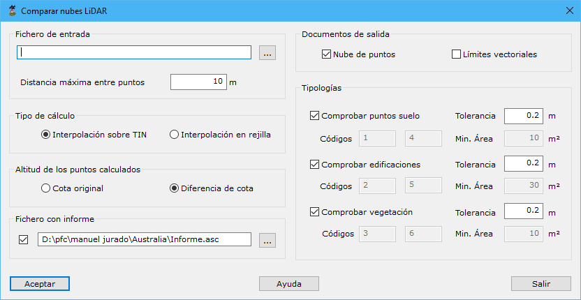

# Comparar nubes

[Generar a partir de LIDAR](../../fichas-de-herramientas/ficha-de-herramientas-archivos-lidar/calcular-a-partir-de-lidar.md)

Esta herramienta tiene como objetivo la comparación de dos nubes de puntos LiDAR, fijándose en la cota de los puntos y el valor de clasificación.

Al llamar a la herramienta, se muestra un cuadro de diálogo con los siguientes campos:

* **Fichero de entrada**: Se deberá indicar un fichero con una nube de puntos LiDAR a comparar con documento actual.
* **Distancia máxima entre puntos**: Distancia máxima para considerar dos puntos como adyacentes o vecinos en el terreno. Este parámetro dependerá de la densidad de puntos.
* **Tipo de cálculo**: Se deberá indicar cómo se va a realizar la comparación, existiendo dos opciones:
  * _Interpolación sobre TIN_: Los cálculos se realizarán sobre un TIN generado con todos los puntos de la tipología indicada.
  * _Interpolación en rejilla_: Los cálculos se realizarán sobre una rejilla previamente calculada con paso la distancia máxima entre puntos.
* **Altitud de los puntos calculados**: Se podrá indicar qué cota tendrán los puntos en los que se encuentren diferencias. Esta cota podrá ser la _cota original_ o la _diferencia_ encontrada entre ambas nubes.
* **Fichero con informe**: Se podrá indicar el nombre de un fichero ASCII donde se almacenarán los datos resultantes de la comparación.
* **Documentos de salida**: Se podrá indicar qué documentos se van a generar después del cálculo. Se tienes dos opciones:
  * _Nube de puntos_: Documento con los puntos comparados donde se ha encontrado diferencias superiores a las tolerancias indicadas.
  * _Límites vectoriales_: Límites vectoriales formados con los puntos donde se han encontrado errores y cuya área sea superior a la indicada.
* **Tipologías**: Se podrán seleccionar las tipologías que se tendrán en cuenta en la comparación, pudiendo ser tres: _suelo_, _edificaciones_ y _vegetación_. Por cada uno de ellos, se podrán indicar los siguientes campos:
  * _Tolerancia_: En este campo se deberá indicar un valor en metros a partir del cual el programa detectará como error cualquier diferencia encontrada, positiva o negativa, entre las cotas en ambas nubes de puntos.
  * _Código_: Si se selecciona como documento de salida los límites vectoriales, se deberá indicar el código con el que se registrarán los límites correspondientes a esta tipología.
  * _Min. área_: Si se selecciona como documento de salida los límites vectoriales, se deberá indicar el valor mínimo del área que tendrá que tener un límite para ser registrado.
