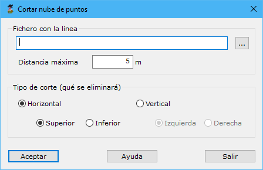

# Cortar nube

[Generar a partir de LIDAR](../../fichas-de-herramientas/ficha-de-herramientas-archivos-lidar/calcular-a-partir-de-lidar.md)

Herramienta destinada al corte de una nube de puntos a partir de una línea definida por el usuario. Esta utilidad se focaliza en nubes de puntos registradas en túneles o galerías y permite obtener una selección de puntos de alguno de las partes de dicho túnel.

Los parámetros que precisa son los siguientes:

* **Fichero con la línea**: Se precisa de una línea registrada previamente por el usuario. Esta línea podría ser la secuencia de estaciones de registro obtenida con la herramienta [Obtener estaciones](/mdtopx/modulo-laser/generar/obtener-estaciones.md)
* **Tipo de corte (qué se eliminará)**: Se designará que parte se desea eliminar mediante el corte. Podría seleccionarse un corte _Horizontal_ o _Vertical_
