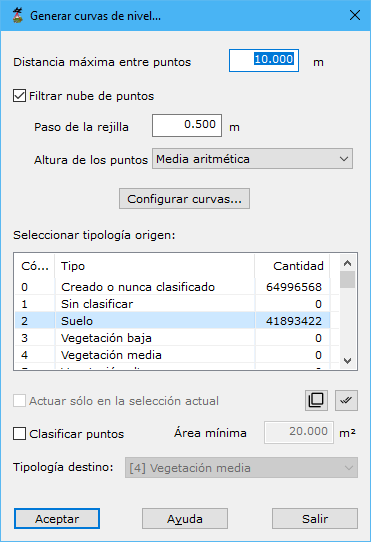

# Curvado a partir de LIDAR

[Generar a partir de LIDAR](../../fichas-de-herramientas/ficha-de-herramientas-archivos-lidar/calcular-a-partir-de-lidar.md)

Esta herramienta está destinada a generar un [curvado](../../como/como-curvado.md)a partir directamente de un archivo de una nube de puntos.

Los parámetros que precisa son los siguientes:

* **Distancia máxima entre puntos**: Distancia máxima para considerar dos puntos como adyacentes o vecinos en el terreno. Este parámetro dependerá de la densidad de puntos.
* **Filtrar nube de puntos**: Si no se marca esta casilla el programa generará un [TIN](../../como/como-triangulacion.md)y lo curvará. Si se activa esta casilla, previo al cálculo se realizará un [filtrado](../editar/filtrar-puntos.md)de los puntos seleccionados. Este filtrado se configura con los siguientes parámetros:
  * _Paso de la rejilla_
  * _Altura de los puntos_
* ****[**Configurar curvas**](../../herramientas-mdt/curvado/): A través de este botón, se pueden configurar las curvas de nivel resultantes.
* **Seleccionar tipología origen**: Se deberá elegir la tipología de clasificación de los puntos que se utilizarán para el cálculo del curvado.
* **Actuar sólo en la selección actual**: Se podrá activar esta opción para calcular sólo en los puntos que actualmente se tengan seleccionados.
* **Clasificar puntos**: Se podrá activar esta opción para clasificar puntos que queden dentro de una curva de nivel que no supere un determinado **área mínima** y según la **tipología de destino** que el usuario seleccione. Esta opción es útil para clasificar aquellos puntos que no fueron identificados en procesos anteriores y que podrían no pertenecer al suelo, como por ejemplo vegetación baja.
