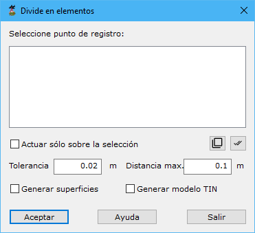

# Divide en elementos

[Generar a partir de LIDAR](../../fichas-de-herramientas/ficha-de-herramientas-archivos-lidar/calcular-a-partir-de-lidar.md)

Herramienta para la clasificación de una nube de puntos obtenida en registro terrestre a partir de los objetos que ha medido. Es decir, dará un valor de tipología diferente en función de los objetos que va identificando.

Los parámetros que precisa son los siguientes:

* **Punto de registro**: Se seleccionarán los puntos de registro con los que se desea realizar la clasificación.
* **Actuar sólo en la selección actual**: Se podrá activar esta opción para calcular sólo en los puntos que actualmente se tengan seleccionados.
* **Tolerancia**: Se indicará una tolerancia en coordenadas terreno, a partir de la cual si dos puntos consecutivos están separados un valor mayor, no se consideraran pertenecientes al mismo objeto.
* **Distancia max**: Distancia máxima entre puntos en el registro
* **Generar superficies**: Se podrá activar esta opción para generar automáticamente superficies con los puntos pertenecientes a un mismo objeto.
* **Generar modelo TIN**: Se podrá activar esta opción para generar automáticamente un modelo TIN con cada uno de los objetos identificados.
