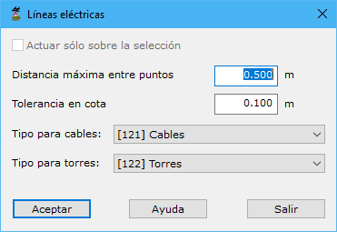

# Líneas eléctricas

[Generar a partir de LIDAR](../../fichas-de-herramientas/ficha-de-herramientas-archivos-lidar/calcular-a-partir-de-lidar.md)

Esta herramienta está destinada a la búsqueda y clasificación de líneas eléctricas y las torres que las soportan.

Los parámetros que precisa son los siguientes:

* **Distancia máxima entre puntos**: Distancia máxima para considerar dos puntos como adyacentes o vecinos en el terreno. Este parámetro dependerá de la densidad de puntos.
* **Tolerancia en cota**: Tolerancia entre los puntos para la localización de cables.
* **Tipo para cables**: Tipología para los puntos registrados sobre cableado.
* **Tipo para torres**: Tipología para los puntos registrados sobre las torres de soporte.
