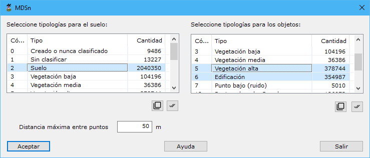

# Modelo Digital de Superficies Normalizado

[Generar a partir de LIDAR](../../fichas-de-herramientas/ficha-de-herramientas-archivos-lidar/calcular-a-partir-de-lidar.md)

Esta herramienta permite calcular una nube de puntos cuya cota es la diferencia de cota sobre una base.

Los parámetros necesarios son los siguientes:

* **Tipologías para el suelo**: Se deberán seleccionar aquellas tipologías con las que se calculará un MDT que actuará de base para calcular las diferencias de cota.
* **Tipologías para los objetos**: Se deberán seleccionar aquellas tipologías en las que se calcularán las diferencias de cota con respecto a la base.
* **Distancia máxima entre puntos**: Distancia máxima para considerar dos puntos como adyacentes o vecinos en el terreno. Este parámetro dependerá de la densidad de puntos.
