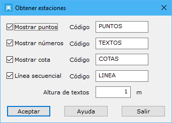

# Obtener estaciones

[Generar a partir de LIDAR](../../fichas-de-herramientas/ficha-de-herramientas-archivos-lidar/calcular-a-partir-de-lidar.md)

Esta herramienta sirve para extraer la posición de los puntos de estación desde donde se ha registrado una nube de puntos, en un registro en estático.

Las posibilidades son las siguientes:

* **Mostrar puntos**: Mostrará una entidad puntual por cada estacionamiento.
* **Mostrar números**: Mostrará un texto con el número de estación. El tamaño del texto será el indicado en el campo Altura de textos
* **Mostrar cota**: Mostrará un texto con el valor de la cota de la estación. El tamaño del texto será el indicado en el campo Altura de textos
* **Línea secuencial**: Generará una línea como unión de la secuencia de estaciones.
