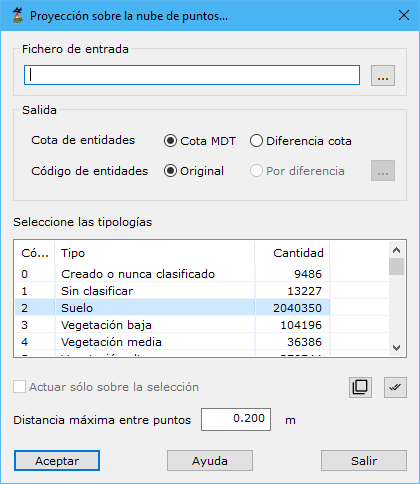

# Proyección sobre la nube de puntos

[Generar a partir de LIDAR](../../fichas-de-herramientas/ficha-de-herramientas-archivos-lidar/calcular-a-partir-de-lidar.md)

Mediante esta herramienta se puede proyectar un archivo vectorial sobre la nube de puntos, aportándole un valor de altitud que dependerá de esta proyección.

Los parámetros necesarios son los siguientes:

* **Fichero de entrada**: Se indicarán el nombre del fichero con las entidades que se desean proyectar. Se podrá utilizar el botón situado a la derecha para ejecutar el explorador de Windows para buscar el archivo. El formato de este fichero puede ser BIN de DIGI, DXF de AutoCad, DGN de MicroStation, Shape de ESRI o un fichero ASCII. Podrán estar almacenados varias entidades, excepto en el caso del fichero de formato ASCII en el que sólo se leerá una en forma de línea.
* **Salida**:
  * _Cota de entidades_: Valor de la Z que se almacenará en cada vértice de cada entidad. Dos opciones:
    * _Cota MDT_: Cota obtenida directamente de la nube de puntos
    * _Diferencia de cota_: Diferencia entre el valor almacenado en el fichero y la proyección sobre la nube de puntos, útil para buscar errores de cota de las entidades
  * _Código de entidades_: Código o capa en el que se almacenarán las entidades vectoriales. Dos opciones:
    * _Original_: No se modifica el código en el que estaba almacenada la entidad originalmente.
    * _Por diferencia_: Se podrá almacenar la entidad con un código diferente en función de la diferencia de cotas (segunda opción del parámetro anterior). La [relación entre el código y la diferencia de cota](../../herramientas-mdt/proyeccion-sobre-mdt/codigos-segun-diferencia-de-cota.md)se puede indicar pulsando el botón que está a la derecha.
* **Tipología LiDAR**: Se deberán seleccionar las tipologías origen que se desean utilizar para calcular la proyección.
* **Actuar sólo en la selección actual**: Se podrá activar esta opción para calcular sólo en los puntos que actualmente se tengan seleccionados.
* **Distancia máxima entre puntos**: Distancia máxima para considerar dos puntos como adyacentes o vecinos en el terreno. Este parámetro dependerá de la densidad de puntos.
