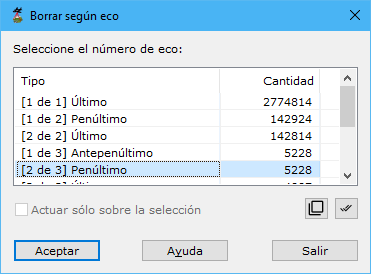

# Borrar según eco

[Según eco LIDAR](/mdtopx/modulo-laser/segun-eco-lidar/)

Esta herramienta está destinada para borrar del fichero aquellos puntos que tengan un determinado eco LiDAR.

Los parámetros que precisa son los siguientes:

* **Seleccione el número de eco**: Se deberán seleccionar los tipos de eco de los puntos que se desean borrar.
* **Actuar sólo en la selección actual**: Se podrá activar esta opción para calcular sólo en los puntos que actualmente se tengan seleccionados.

Vea también:

* [Borrar puntos según punto de registro](../segun-punto-de-registro/borrar-segun-punto-de-registro.md)
* [Borrar puntos según clasificación](../segun-clasificacion-lidar/borrar-segun-clasificacion.md)
* [Borrar puntos según color registrado](../segun-color-registrado/borrar-segun-color-registrado.md)
* [Borrar puntos según intensidad](../segun-intensidad/borrar-segun-intensidad.md)
* [Borrar puntos según tiempo GPS](../segun-tiempo-gps/borrar-segun-tiempo-gps.md)
* [Ficha de herramientas Clasificar LiDAR](/mdtopx/fichas-de-herramientas/ficha-de-herramientas-clasificar-lidar.md)
