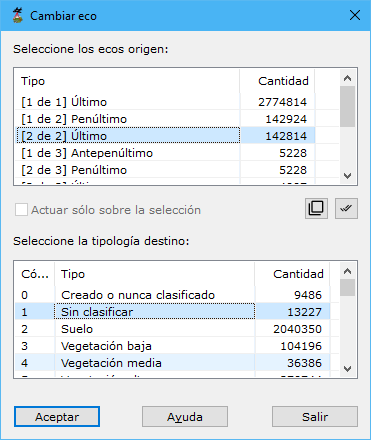

# Cambiar clasificación según eco

[ Según eco LIDAR](./)

Esta herramienta está destinada para cambiar la clasificación de puntos LiDAR en función del eco que tienen.

Los parámetros que precisa son los siguientes:

* **Seleccione los ecos origen**: Se deberán seleccionar los tipos de eco origen de los puntos que se desean cambiar.
* **Seleccione la tipología destino**: Se deberá seleccionar la tipología a la cual se van a cambiar los puntos que se seleccionen.
* **Actuar sólo en la selección actual**: Se podrá activar esta opción para calcular sólo en los puntos que actualmente se tengan seleccionados.

Vea también:

* [Cambiar según punto de registro](/mdtopx/modulo-laser/segun-punto-de-registro/cambiar-segun-punto-de-registro.md)
* [Cambiar clasificación](/mdtopx/modulo-laser/segun-clasificacion-lidar/cambiar-clasificacion.md)
* [Cambiar según color registrado](/mdtopx/modulo-laser/segun-color-registrado/cambiar-segun-color-registrado.md)
* [Cambiar según intensidad](/mdtopx/modulo-laser/segun-intensidad/cambiar-segun-intensidad.md)
* [Ficha de herramientas Clasificar LiDAR](/mdtopx/fichas-de-herramientas/ficha-de-herramientas-clasificar-lidar.md)
