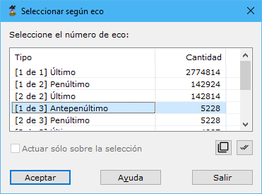

# Seleccionar según eco

[Según eco LIDAR](/mdtopx/modulo-laser/segun-eco-lidar/)

Esta herramienta está destinada para seleccionar del fichero aquellos puntos que tengan un determinado eco LiDAR y guardarlos en un nuevo documento.

Los parámetros que precisa son los siguientes:

* **Seleccione el número de eco**: Se deberán seleccionar los tipos de ecos de los puntos que se desean seleccionar.
* **Actuar sólo en la selección actual**: Se podrá activar esta opción para calcular sólo en los puntos que actualmente se tengan seleccionados.

Vea también:

* [Seleccionar según punto de registro](/mdtopx/modulo-laser/segun-punto-de-registro/seleccionar-segun-punto-de-registro.md)
* [Seleccionar según clasificación](/mdtopx/modulo-laser/segun-clasificacion-lidar/seleccionar-segun-clasificacion.md)
* [Seleccionar según color registrado](/mdtopx/modulo-laser/segun-color-registrado/seleccionar-segun-color-registrado.md)
* [Seleccionar según intensidad](/mdtopx/modulo-laser/segun-intensidad/seleccionar-segun-intensidad.md)
* [Seleccionar según tiempo GPS](/mdtopx/modulo-laser/segun-tiempo-gps/seleccionar-segun-tiempo-gps.md)
* [Cambiar clasificación en gráfico](/mdtopx/modulo-laser/editar/cambiar-clasificacion-en-grafico.md)
* [Ficha de herramientas Clasificar LiDAR](/mdtopx/fichas-de-herramientas/ficha-de-herramientas-clasificar-lidar.md)
