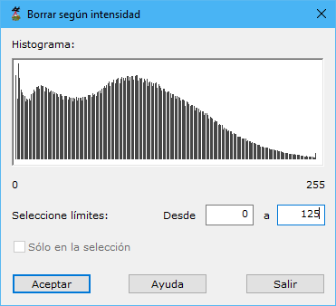

# Borrar según intensidad

[Según intensidad](/mdtopx/modulo-laser/segun-intensidad/)

Esta herramienta está destinada para borrar del fichero aquellos puntos que hayan sido registrados con una intensidad determinada.

Los parámetros que precisa son los siguientes:

* **Seleccione límites**: Se deberán indicar los valores mínimo y máximo de intensidad dentro de los cuales se borrarán los puntos. Para facilitar esta labor se muestra el histograma de los puntos que contiene el archivo. Moviéndose con el ratón encima de este histograma se mostrarán la cantidad de puntos y el valor de intensidad.
* **Actuar sólo en la selección actual**: Se podrá activar esta opción para calcular sólo en los puntos que actualmente se tengan seleccionados.

Vea también:

* [Borrar puntos según punto de registro](../segun-punto-de-registro/borrar-segun-punto-de-registro.md)
* [Borrar puntos según clasificación](../segun-clasificacion-lidar/borrar-segun-clasificacion.md)
* [Borrar puntos según color registrado](../segun-color-registrado/borrar-segun-color-registrado.md)
* [Borrar puntos según eco](../segun-eco-lidar/borrar-segun-eco.md)
* [Borrar puntos según tiempo GPS](../segun-tiempo-gps/borrar-segun-tiempo-gps.md)
* [Ficha de herramientas Clasificar LiDAR](/mdtopx/fichas-de-herramientas/ficha-de-herramientas-clasificar-lidar.md)
