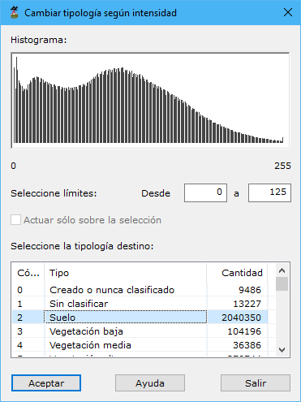

# Cambiar según intensidad

[Según intensidad](/mdtopx/modulo-laser/segun-intensidad/)

Esta herramienta está destinada para cambiar la tipología de puntos LiDAR en función de la intensidad registrada en cada punto.

Los parámetros que precisa son los siguientes:

* **Seleccione límites**: Se deberán indicar los valores mínimo y máximo de intensidad dentro de los cuales se seleccionarán los puntos. Para facilitar esta labor se muestra el histograma de los puntos que contiene el archivo. Moviéndose con el ratón encima de este histograma se mostrarán la cantidad de puntos y el valor de intensidad.
* **Seleccione la tipología destino**: Se deberá seleccionar la tipología a la cual se van a cambiar los puntos que se seleccionen.
* **Actuar sólo en la selección actual**: Se podrá activar esta opción para calcular sólo en los puntos que actualmente se tengan seleccionados.

Vea también:

* [Cambiar según punto de registro](/mdtopx/modulo-laser/segun-punto-de-registro/cambiar-segun-punto-de-registro.md)
* [Cambiar clasificación](/mdtopx/modulo-laser/segun-clasificacion-lidar/cambiar-clasificacion.md)
* [Cambiar clasificación según eco](/mdtopx/modulo-laser/segun-eco-lidar/cambiar-clasificacion-segun-eco.md)
* [Cambiar según color registrado](/mdtopx/modulo-laser/segun-color-registrado/cambiar-segun-color-registrado.md)
* [Ficha de herramientas Clasificar LiDAR](/mdtopx/fichas-de-herramientas/ficha-de-herramientas-clasificar-lidar.md)
