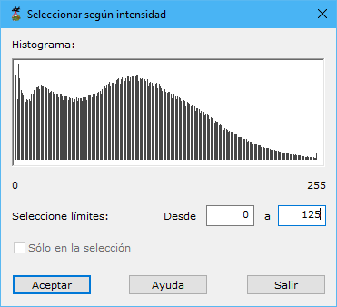

# Seleccionar según intensidad

[Según intensidad](/mdtopx/modulo-laser/segun-intensidad/)

Esta herramienta está destinada para seleccionar del fichero aquellos puntos que hayan sido registrados mediante una determinada intensidad y guardarlos en un nuevo documento.

Los parámetros que precisa son los siguientes:

* **Seleccione limites**: Se deberán indicar los valores mínimo y máximo de intensidad dentro de los cuales se seleccionarán los puntos. Para facilitar esta labor se muestra el histograma de los puntos que contiene el archivo. Moviéndose con el ratón encima de este histograma se mostrarán la cantidad de puntos y el valor de intensidad.
* **Actuar sólo en la selección actual**: Se podrá activar esta opción para calcular sólo en los puntos que actualmente se tengan seleccionados.

Vea también:

* [Seleccionar según punto de registro](/mdtopx/modulo-laser/segun-punto-de-registro/seleccionar-segun-punto-de-registro.md)
* [Seleccionar según eco](/mdtopx/modulo-laser/segun-eco-lidar/seleccionar-segun-eco.md)
* [Seleccionar según clasificación](/mdtopx/modulo-laser/segun-clasificacion-lidar/seleccionar-segun-clasificacion.md)
* [Seleccionar según color registrado](/mdtopx/modulo-laser/segun-color-registrado/seleccionar-segun-color-registrado.md)
* [Seleccionar según tiempo GPS](/mdtopx/modulo-laser/segun-tiempo-gps/seleccionar-segun-tiempo-gps.md)
* [Cambiar clasificación en gráfico](/mdtopx/modulo-laser/editar/cambiar-clasificacion-en-grafico.md)
* [Ficha de herramientas Clasificar LiDAR](/mdtopx/fichas-de-herramientas/ficha-de-herramientas-clasificar-lidar.md)
