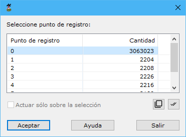

# Borrar según punto de registro

[Según punto de registro](/mdtopx/modulo-laser/segun-punto-de-registro/)

Esta herramienta está destinada para borrar del fichero aquellos puntos que hayan sido registrados desde algún punto determinado.

Los parámetros que precisa son los siguientes:

* **Seleccione punto de registro**: Se deberán seleccionar los puntos de registro que se desean borrar.
* **Actuar sólo en la selección actual**: Se podrá activar esta opción para calcular sólo en los puntos que actualmente se tengan seleccionados.

Vea también:

* [Borrar puntos según clasificación](../segun-clasificacion-lidar/borrar-segun-clasificacion.md)
* [Borrar puntos según color registrado](../segun-color-registrado/borrar-segun-color-registrado.md)
* [Borrar puntos según intensidad](../segun-intensidad/borrar-segun-intensidad.md)
* [Borrar puntos según eco](../segun-eco-lidar/borrar-segun-eco.md)
* [Borrar puntos según tiempo GPS](../segun-tiempo-gps/borrar-segun-tiempo-gps.md)
* [Ficha de herramientas Clasificar LiDAR](/mdtopx/fichas-de-herramientas/ficha-de-herramientas-clasificar-lidar.md)
