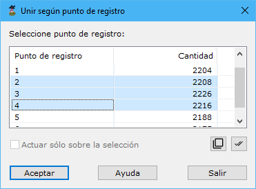

# Unir puntos de registro

[Según punto de registro](/mdtopx/modulo-laser/segun-punto-de-registro/)

Esta herramienta está destinada para unir nubes LiDAR registradas desde puntos diferentes.

Los parámetros que precisa son los siguientes:

* **Seleccione los puntos de registro origen**: Se deberán seleccionar los puntos de registro origen de los puntos que se desean unir.
* **Actuar sólo en la selección actual**: Se podrá activar esta opción para calcular sólo en los puntos que actualmente se tengan seleccionados.

Vea también:

* [Cambiar según punto de registro](/mdtopx/modulo-laser/segun-punto-de-registro/cambiar-segun-punto-de-registro.md)
* [Cambiar clasificación](/mdtopx/modulo-laser/segun-clasificacion-lidar/cambiar-clasificacion.md)
* [Cambiar clasificación según eco](/mdtopx/modulo-laser/segun-eco-lidar/cambiar-clasificacion-segun-eco.md)
* [Cambiar según color registrado](/mdtopx/modulo-laser/segun-color-registrado/cambiar-segun-color-registrado.md)
* [Cambiar según intensidad](/mdtopx/modulo-laser/segun-intensidad/cambiar-segun-intensidad.md)
* [Ficha de herramientas Clasificar LiDAR](/mdtopx/fichas-de-herramientas/ficha-de-herramientas-clasificar-lidar.md)
