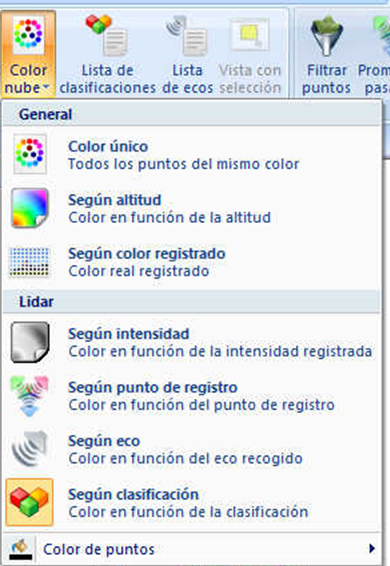

# Color de nube

[Vista de puntos láser](/mdtopx/fichas-de-herramientas/ficha-de-herramientas-archivos-lidar/vista-de-puntos-laser.md)

Desde este listado se puede elegir cómo se quiere visualizar la nube de puntos. Las opciones de este listado también variarán en función de las propiedades contenidas en la nube de puntos.

Las opciones son las siguientes:

* **Color único**: Se mostrarán todos los puntos utilizando el mismo color. Dicho color puede ser definido desde la opción **Color de puntos** de este listado.
* **Según intensidad**: Se mostrarán los puntos en diferentes colores en función de la intensidad registrada por el dispositivo láser.
* **Según eco**: Se mostrarán los puntos en función del eco LiDAR que los registró. El color de cada eco puede ser definido desde la [lista de ecos](lista-de-ecos.md). Esta opción sólo tiene sentido se se tienen diferentes ecos o rebotes en la nube de puntos, habitual en nubes de puntos LiDAR aéreo.
* **Según clasificación**: Se mostrarán los puntos en función de la clasificación LiDAR que tienen asignada. El color de cada clasificación puede ser definido desde la [lista de clasificaciones](lista-de-clasificaciones.md).
* **Según altitud**: Se mostrarán los puntos en función de la altitud o coordenada Z que tenga cada punto. Cuando se seleccione el programa mostrará un [cuadro de diálogo](../../otras-herramientas/seleccionar-gama-de-color.md)donde se podrá especificar la gama de color a utilizar.
* **Según punto de registro**: Se mostrarán los puntos con color diferente en función del punto desde el cual fueron registrados. Esta opción permitirá conocer las diferentes pasadas si es un archivo LiDAR aéreo o los diferentes estacionamientos si es un archivo de LiDAR terrestre.
* **Color de puntos**: Desde esta opción se podrá elegir el color a utilizar para mostrar los puntos, en caso de que la opción elegida sea **Color único**.
