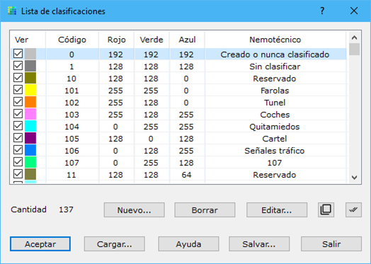

# Lista de clasificaciones

[Vista de puntos láser](/mdtopx/fichas-de-herramientas/ficha-de-herramientas-archivos-lidar/vista-de-puntos-laser.md)

La clasificación es un valor que permitirá saber de qué tipología es el elemento donde reflejó el rayo láser. Así se podría indicar que el elemento es asfalto, o vegetación o una señal de tráfico. Este valor es añadido en procesos de análisis de la información y no es registrado por el sistema LiDAR. A partir de una correcta asignación de este valor, se podría obtener el modelo correspondiente a cada objeto, agrupando los puntos que tengan el valor seleccionado.

Hay un conjunto de valores que están habitualmente reservados, siguiendo la definición del formato LAS que en su momento realizó la ASPRS. Por ejemplo, los siguientes:

* 0: Creado o nunca clasificado
* 1: Sin clasificar
* 2: Suelo
* 3: Vegetación baja
* 4: Vegetación media
* 5: Vegetación alta
* 6: Edificación
* 7: Punto bajo (ruido)
* 8: Punto clave modelo
* 9: Agua
* 10: Reservado
* 11: Reservado
* 12: Punto solapado

El resto de las clasificaciones, hasta 255, estarían vacías pudiendo ser utilizadas para clasificaciones personalizadas en función de la naturaleza del proyecto.

Inicialmente, toda la nube vendrá con clasificación 0.

Obviamente, se podrían clasificar puntos manualmente, seleccionando en pantalla y modificándolos, pero esto no tiene sentido en proyectos de miles de millones puntos.

En este cuadro de diálogo aparecen las clasificaciones que el programa utilizará para pintar los puntos LiDAR en pantalla.

Se pueden especificar el grosor y color de cada clasificación.

La lista se puede salvar a un archivo ASCII pulsando el botón **Salvar** o cargar desde un archivo pulsando el botón **Cargar**.

Se pueden editar las características de uno de ellos pulsando el botón **Editar** o haciendo doble clic con el botón izquierdo del ratón sobre el tipo, apareciendo un [cuadro de diálogo](../../otras-herramientas/lista-de-codigos/codigo-nuevo.md).

Los cambios efectuados sólo serán válidos si pulsa el botón **Aceptar** para salir.
