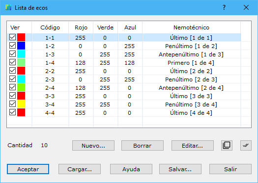

# Lista de ecos

[Vista de puntos láser](/mdtopx/fichas-de-herramientas/ficha-de-herramientas-archivos-lidar/vista-de-puntos-laser.md)

En este cuadro de diálogo aparecen los tipos de eco que el programa utilizará para pintar los puntos LiDAR en pantalla.

Se pueden especificar el grosor y color de cada clasificación.

La lista se puede salvar a un archivo ASCII pulsando el botón **Salvar** o cargar desde un archivo pulsando el botón **Cargar**.

Se pueden editar las características de uno de ellos pulsando el botón **Editar** o haciendo doble clic con el botón izquierdo del ratón sobre el tipo, apareciendo un [cuadro de diálogo](../../otras-herramientas/lista-de-codigos/codigo-nuevo.md).

Los cambios efectuados sólo serán válidos si pulsa el botón **Aceptar** para salir.
