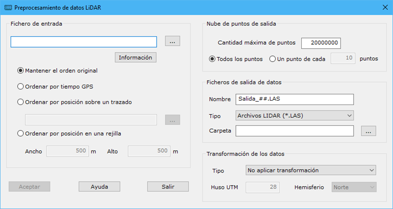

# Preprocesar

[Vista de puntos láser](/mdtopx/fichas-de-herramientas/ficha-de-herramientas-archivos-lidar/vista-de-puntos-laser.md)

Herramienta destinada a procesar un archivo LiDAR, sin necesidad de ser abierto o visualizado. Ofrece la posibilidad de cambiar coordenadas o subdividir el archivo en trozos. Esta última opción es muy útil para tratar archivos de grandes dimensiones.

Los parámetros que precisa son los siguientes:

* **Fichero de entrada**: Se especificará el nombre de entrada del fichero a tratar, pudiendo pulsar el botón a la derecha para poder abrir el explorar de Windows y seleccionarlo. Después de indicar el nombre, se puede pulsar el botón **Información** y mostrará el cuadro de diálogo [Propiedades Doc Láser](propiedades-documento-laser.md)con el contenido del archivo. La lectura del archivo tiene varias opciones:
  * _Mantener el orden original_: Se procesarán los puntos en función de su posición en el fichero.
  * _Ordenar por tiempo GPS_: Se realizará una primera lectura del archivo para ordenar los puntos en función de su parámetro de tiempo GPS y luego se procesará.
  * _Ordenar por posición sobre un trazado_: Se realizará un proyección sobre una entidad lineal que hará de eje y se ordenarán en función de dicha proyección. El eje podrá estar almacenado en formato BIN, DXF, DGN o Shape.
  * _Ordenar por posición en una rejilla_: Se ordenarán los puntos en función de una cuadrícula. Dicha cuadrícula se podrá definir con los parámetros **Ancho** y **Alto**, actuando como dimensiones de cada una de las celdas.
*   **Nube de puntos de salida**: Se podrá definir cómo ha de ser la nube de puntos resultante.&#x20;

    Se podrá especificar la **Cantidad máxima de puntos** que contendrán cada archivo de salida. Además, también se puede especificar se se utilizarán todos los puntos o sólo un punto de cada x.&#x20;
* **Nombre de salida**:
  * _Nombre del archivo de salida_. Se podrá indicar con el carácter almohadilla los índices de los archivos, en caso de tratarse de una división de archivos. Por ejemplo, "Salida\_##.LAS" generará los archivos "Salida\_01.LAS", "Salida\_02.LAS", etc.
  * _Tipo_: Se podrá especificar en qué formato se desean salvar los archivos de salida.
  * _Carpeta_: Se podrá especificar la carpeta donde se almacenarán los archivos de salida.
* **Transformación de los datos**: Se podrá especificar si se desea un cambio de coordenadas, dándose la opción "_De coordenadas cartesianas a UTM_" o "_De coordenadas geográficas a UTM_".
