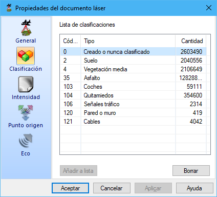

# Propiedades Documento Láser

[Vista de puntos láser](/mdtopx/fichas-de-herramientas/ficha-de-herramientas-archivos-lidar/vista-de-puntos-laser.md)

Mediante este cuadro de diálogo, el programa muestra diferentes características del documento con información proveniente de un láser. A la derecha del cuadro de diálogo se muestran las partes en las que se ha subdividido la información.

Esta información está organizada de la siguiente forma:

* **General**: En esta pestaña se muestra información genérica del archivo como cantidad de puntos, área cubierta y densidad de puntos.

* ****[**Clasificación**](../segun-clasificacion-lidar/): Se mostrará la cantidad de puntos agrupados según la clasificación LiDAR que tengan asignada. Se podría seleccionar uno o varios tipos y eliminarlos del archivo actual, pulsando el botón **Borrar**. Si algún tipo no tiene descripción podría ser porque no está añadido a la [lista de clasificaciones](lista-de-clasificaciones.md); se podría añadir pulsando el botón **Añadir a lista**.

* ****[**Intensidad**](../segun-intensidad/): Se mostrará un histograma con la distribución de los puntos en función de la intensidad que tienen registrada.

* ****[**Punto origen**](../segun-punto-de-registro/): Se mostrará la cantidad de puntos agrupados según el punto desde el que fueron registrados. Se podría seleccionar uno o varios orígenes y eliminarlos del archivo actual, pulsando el botón **Borrar**.

* ****[**Eco**](../segun-eco-lidar/): Se mostrará la cantidad de puntos agrupados según el eco con el que fueron registrados. Se podría seleccionar uno o varios tipos y eliminarlos del archivo actual, pulsando el botón **Borrar**. Si algún tipo no tiene descripción podría ser porque no está añadido a la [lista de ecos](lista-de-ecos.md); se podría añadir pulsando el botón **Añadir a lista**.

