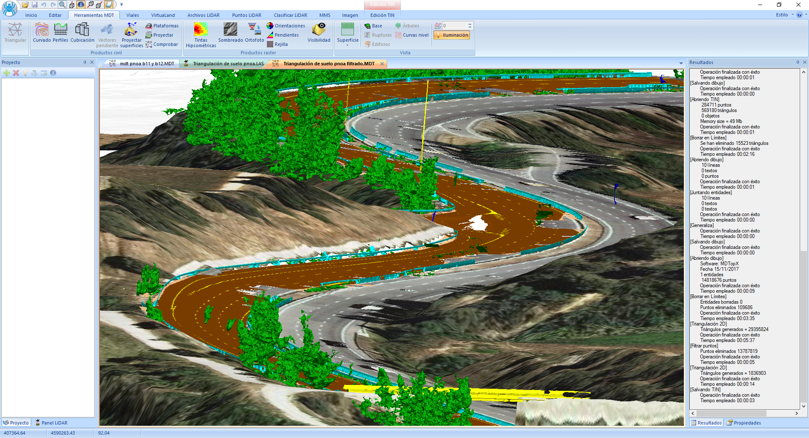

# Módulo MMS

[¿Qué es MDTopX?](../introduccion/mdtopx.md)

El módulo MMS tiene como objetivo la gestión y tratamiento de archivos procedentes del registro de nubes de puntos por medio de sistemas Mobile Mapping. Estos sistemas están compuestos de diferentes sensores que permiten la recogida de densas nubes de puntos pertenecientes a vías como carreteras, calles o líneas de ferrocarril.

Las herramientas de este módulo están dispuestas en la cinta de [Herramientas MMS](../fichas-de-herramientas/ficha-de-herramientas-mms.md).

<video controls><source src="https://youtu.be/EppZkcVY1MM" type="video/mp4"></video>
Gestión de nube de puntos registrada con sensor MMS

<video controls><source src="https://youtu.be/6pgNWc6ZQhI" type="video/mp4"></video>
Gestión de nube de puntos de sensor Leica Pegasus Backpack


\
Para realizar las operaciones necesarias para el tratamiento de datos MMS, es importante que el equipo tenga suficiente memoria RAM para albergar los diferentes cálculos. El mínimo estaría en 8 Gb, aunque es recomendable tener 16 Gb. Aunque no se van a realizar visualizaciones de muchos datos, se recomienda que, al menos, la tarjeta de video tenga 1 Gb de RAM. Por último, los datos son voluminosos y aunque no se van a generar muchos datos adicionales, se necesitarán 4 Gb de espacio libre en el disco duro por cada kilómetro de registro.

Los archivos con la información MMS pueden ser de dos tipos: [nubes de puntos](archivos-de-nubes-de-puntos-mms.md) o [imágenes 360º](archivos-de-imagen-360-mms.md).

Aunque podemos abrir un archivo de forma individual para analizar alguna de sus propiedades o simplemente visualizar, es más correcto tener todos los archivos relacionados en un único espacio. Para ello, se puede crear un [proyecto](../operaciones-con-archivos/proyectos-de-mdtopx.md)donde se podrán añadir archivos de diferente índole: vectoriales, ráster, modelos digitales o archivos de geometría. Un proyecto sólo es una relación de archivos; éstos no se duplican, sólo se almacena la dirección donde están almacenados en el disco.

No obstante, se recomienda crear un proyecto donde incluir las nubes de puntos y otro proyecto donde incluir las imágenes 360, si estas han sido tomadas. La [gestión de las imágenes 360](gestion-de-imagenes-360.md) requiere un tratamiento especial.

De esta forma, cuando se ejecuten ciertas herramientas, podrán ser realizadas en modo por lotes, procesando los archivos seleccionados. Además, tiene la ventaja de dar continuidad a los cálculos realizados. Por último, cuando se estén utilizando los archivos para calcular, éstos no se visualizarán en pantalla, rebajando la necesidad de memoria en el equipo.

En los siguientes enlaces se desarrollan los pasos a abordar en cada trabajo específico:

* [Flujo de trabajo para el inventariado de una carretera](/mdtopx/modulo-mms/flujo-de-trabajo-para-el-inventariado-de-una-carretera.md)
* [Flujo de trabajo para el inventariado de una línea férrea](flujo-de-trabajo-para-el-inventario-de-una-linea-ferrea.md)
