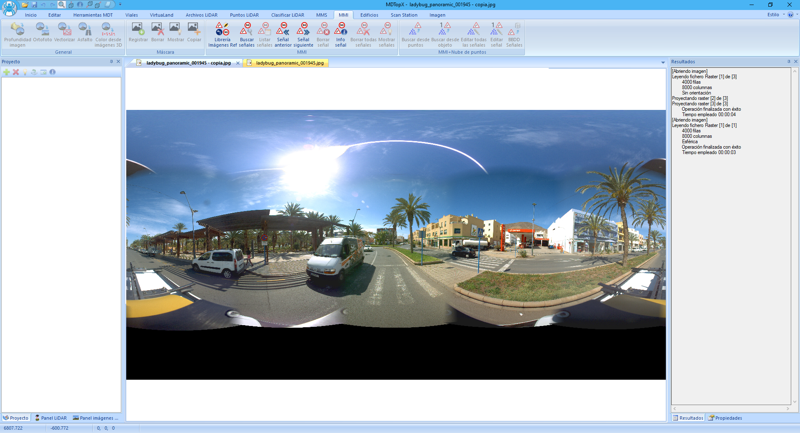
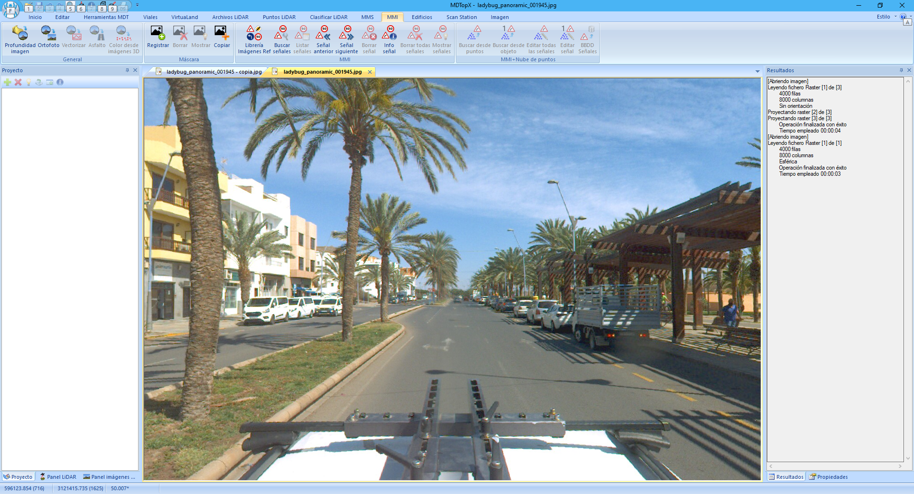

# Archivos de imagen 360 MMS

[Módulo MMS](/mdtopx/modulo-mms/)

Las imágenes 360º abarcan casi toda la esfera desde un determinado punto de vista. La parte no registrada dependerá de dónde esté ubicada la o las cámaras, debido a que se registrará el soporte y el vehículo que la transporta. Esta imagen será el resultado de la unión de dos o más imágenes, por lo que es posible que se encuentren defectos en la unión de las imágenes.

Cada imagen vendrá georreferenciada. Esta georreferenciación no está almacenada en la propia imagen, sino que está en ficheros adicionales. La georreferenciación constará de una posición XYZ y tres ángulos indicando la actitud de la cámara en el momento del registro.

La edición de los datos de georreferenciación se puede realizar con la herramienta [Editar](/mdtopx/modulo-laser/editar/).

Estos archivos son valiosos para la visualización y análisis de datos. Sin embargo, no tienen, inicialmente, información 3D del objeto. En las zonas cercanas al sensor el poder resolutivo es muy superior al sensor LiDAR y, por tanto, se podrían obtener mejor la definición de algunos objetos, como la señalización horizontal de la vía.
