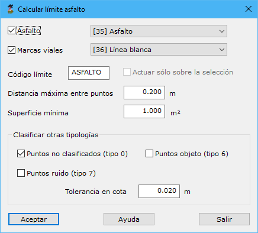

# Calcular límite de asfalto

[Ficha de herramientas MMS Editar objetos](./)

Una vez realizado la clasificación de las líneas de vial, se tendrán puntos clasificados como asfalto. Mediante esta herramienta se puede realizar un control de calidad de lo calculado y corregir errores.

Después de ser ejecutada, se muestran los límites de asfalto. 

En el cuadro de diálogo, se podría indicar si se quieren extraer los límites de asfalto a partir de los puntos clasificados como asfalto y/o marcas viales que se podrán editar a continuación. Esta herramienta generará unos límites que quedan almacenados en memoria y ser editados pintando en pantalla un nuevo segmento de límite con el botón izquierdo del ratón y finalizando con el botón derecho.

Los parámetros de este cuadro de diálogo son los siguientes:‌

* Asfalto:
* Marcas viales
* Código del límite
* Actuar sólo sobre la selección
* Distancia máxima entre puntos
* Superficie mínima
* Clasificar otras tipologías:
  * Puntos no clasificados
  * Puntos objeto
  * Puntos ruido
  * Tolerancia en cota

Vea también:

* [Clasificar líneas de vial](/mdtopx/modulo-mms/trazado/clasificar-lineas-de-vial.md)
* [Calcular líneas de vial](/mdtopx/modulo-mms/editar-objetos/calcular-lineas-de-vial.md)
