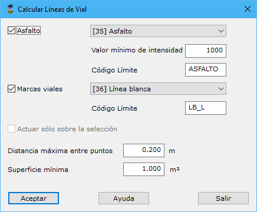

# Calcular líneas de vial

[Ficha de herramientas MMS Editar objetos](./)

Una vez realizado la clasificación de las líneas de vial, se tendrán puntos clasificados como señalización horizontal. Mediante esta herramienta se puede realizar un control de calidad de lo calculado y corregir errores.

Después de ser ejecutada, se muestran los límites de señalización horizontal detectados y los posibles, a partir de la intensidad. 

Señalando con una línea en pantalla (introducida con el botón izquierdo del ratón), se pueden cambiar las tipologías de cada una de estas superficies. Es decir, seleccionando límites detectados (erróneamente) se pueden cambiar la clasificación de sus puntos a solo asfalto. Asimismo, seleccionando límites no detectados, se podría cambar la clasificación de los puntos a señalización horizontal.

Los parámetros de este cuadro de diálogo son los siguientes:

* Asfalto:
  * Tipología
  * Valor mínimo de intensidad
  * Código del límite
* Marcas viales
  * Tipología
  * Código del límite
* Actuar sólo sobre la selección
* Distancia máxima entre puntos
* Superficie mínima

Vea también:‌

* ​[Clasificar líneas de vial](/mdtopx/modulo-mms/trazado/clasificar-lineas-de-vial.md)​
* [​Calcular líneas de asfalto](calcular-limite-de-asfalto.md)
