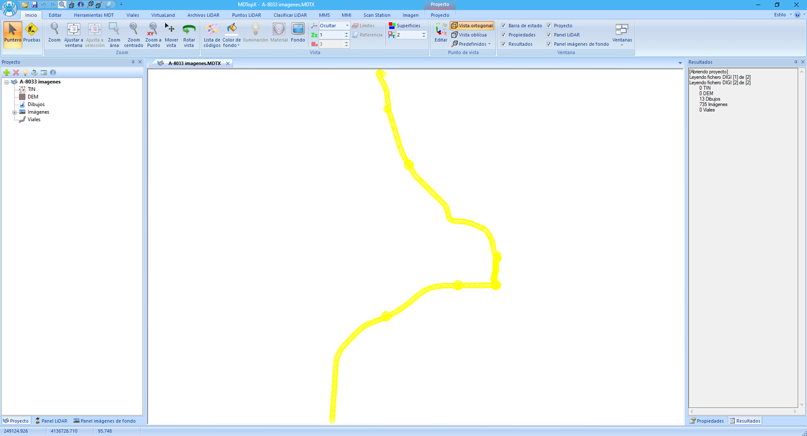

# Gestión de imágenes 360

[Módulo MMS](/mdtopx/modulo-mms/)

### Georreferenciación

Para utilizar las [imágenes panorámicas](archivos-de-imagen-360-mms.md)se precisa la orientación externa de éstas. Esta orientación externa se compone de una posición georreferenciada XYZ y tres ángulos. Estos ángulos suelen ser las rotaciones alrededor de los tres ejes del sistema de coordenadas del vehículo, es decir, alabeo, cabecera y acimut. Toda esta formación se suele proporcionar en un único archivo, generado después de ajustar la trayectoria del vehículo.

Hay que tener en cuenta que se tiene una imagen cada poco espacio, por ejemplo, cada 10 m. Por tanto, se tienen casi 100 imágenes por cada kilómetro de registro. Al ser tantas imágenes, la georreferenciación no suele realizarse manualmente, una a una. Para esta operación se deberían cargar todas las imágenes en un proyecto y asignarles la georreferenciación leyendo el archivo con dichos valores.

Para cargar la orientación de las imágenes, primeramente, se crea un proyecto para añadir las imágenes. Inicialmente, es mejor tener un proyecto para las imágenes y otro para los archivos LiDAR. Para agregar las imágenes, se pueden seleccionar desde un Explorador de archivos y soltar la selección sobre la [ventana del Proyecto](../introduccion/paneles-de-la-aplicacion/panel-proyecto.md). También se puede utilizar el botón “+” que aparece en la barra de herramientas de la ventana Proyecto.

Como inicialmente no tendrán orientación externa generada, se generarán los límites rectangulares unos encima de otros, en coordenadas relativas, considerando que cada píxel tiene un tamaño de 1.

Para cargar las orientaciones desde archivo, hay que utilizar la herramienta [Editar](/mdtopx/modulo-laser/editar/).

Como las imágenes son panorámicas, se elegir la tercera opción donde se podría indicar un fichero opcional con ciertas características de la cámara. En este archivo se podrá indicar el rango horizontal o vertical de la imagen panorámica, ya que ciertos sistemas no graban toda la esfera 360.

A continuación, habrá que indicar el archivo donde se encuentran las orientaciones externas de las imágenes. Además, se deberá indicar qué formato tiene.

Un ejemplo de este tipo de archivos es el siguiente:

```
file_name,file_type,sequence_id,timestamp,GPS_time(s),east,north,altitude,attitude(x)=roll,attitude(y)=pitch,attitude(z)=pan,frame_id
E:/2021-03-15_11-47-26/ladybug_panoramic_001929.jpg,JPG,1929,162259326648,1299841796.17742848,596126.402298610075,3121341.12428526115,51.4542347844690084,177.971166137430686,2.05551927384272703,-93.0967238715002026,3791
E:/2021-03-15_11-47-26/ladybug_panoramic_001930.jpg,JPG,1930,162356296464,1299841797.14712691,596131.650464848964,3121341.97523138579,51.2559816902503371,177.033894729433285,0.378351863176165426,-113.457547588796572,3792
E:/2021-03-15_11-47-26/ladybug_panoramic_001931.jpg,JPG,1931,162455886013,1299841798.14302278,596136.238556805649,3121344.82461331319,51.1919172378256917,176.771113624685285,-0.33364872741620677,-137.619259427909441,3793
```

Si la lectura se realiza con éxito, se actualizarán los límites de las imágenes y se podrá ver la disposición de éstas en el proyecto. Además, se generará un archivo adicional por cada imagen con el mismo nombre y extensión ORI. En él, se almacenará la orientación externa.



Estos límites pueden ser exportados como un fichero de dibujo adicional desde la herramienta **Exportar límites** de la cinta de herramientas [Proyecto](../fichas-de-herramientas/ficha-de-herramientas-proyecto/limites-proyecto.md).

Asimismo, a partir de la posición de cada una de las imágenes es posible generar una polilínea con el trazado seguido por el vehículo que transportaba el sensor MMS. Para ello se puede utilizar la herramienta **Trazado desde imágenes** de la cinta de herramientas [Proyecto](../fichas-de-herramientas/ficha-de-herramientas-proyecto/limites-proyecto.md).

### Utilización de las imágenes

Una vez generadas las orientaciones de las imágenes, éstas podrán ser utilizadas para visualizar los datos vectoriales junto con los ráster. Existen varias maneras de visualizar ambos datos de manera conjunta:

* Abrir una imagen y cargar como referencia la nube de puntos de la zona. En este caso, no se podrán editar datos o añadir elementos vectoriales, puesto que el documento actual es la imagen.
*   Abrir la nube de puntos y cargar como la imagen. Esta operación también se puede hacer de dos formas, no habiendo diferencia entre ambas:

    * [Cargar como **referencia**](../operaciones-con-archivos/abrir-archivos-de-referencia.md), desde el grupo [Archivo](../fichas-de-herramientas/ficha-de-herramientas-editar/editar-archivo.md)del menú [Editar](/mdtopx/modulo-laser/editar/).
    * Cargar como **imagen de fondo**, desde el grupo [Editar](../fichas-de-herramientas/ficha-de-herramientas-archivos-lidar/editar-puntos-en-archivos-lidar.md)del menú [Archivos LiDAR](../fichas-de-herramientas/ficha-de-herramientas-archivos-lidar/)

    En este caso, se podrá editar la nube de puntos. Tiene el inconveniente que se deberá saber qué imagen cae en la zona. Esta imagen abarcará una zona, relativamente pequeña por lo que se deberá cambiar de imagen frecuentemente para analizar todo el fichero.
* Abrir la nube de puntos y cargar como imagen de fondo el proyecto que contiene todas las imágenes panorámicas. En este caso, se cargará inicialmente la imagen más cercana al centro de la nube, pero se activarán herramientas que permitirán cambiar de imagen rápidamente. Estas herramientas están disponibles en la barra de herramientas [MMS](../fichas-de-herramientas/ficha-de-herramientas-mms.md), grupo [Imagen de fondo](/mdtopx/modulo-mms/imagen-de-fondo.md), donde se podrá ver qué imagen está cargada e igualmente moverse a la siguiente o anterior o a la indicada por el usuario.
