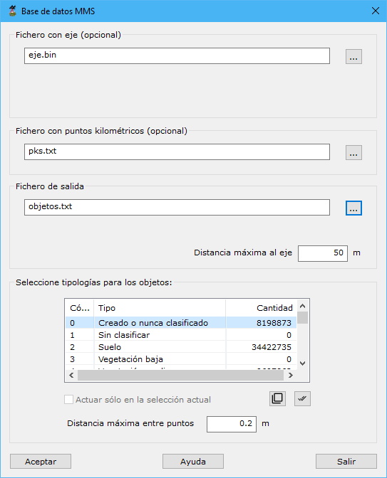

# Base de datos MMS

[Ficha de herramientas MMS Trazado](./)

<video controls><source src="https://youtu.be/SN8sfjfVp1g" type="video/mp4"></video>
Relleno de base de datos con los activos de un vial a partir de datos MMS

