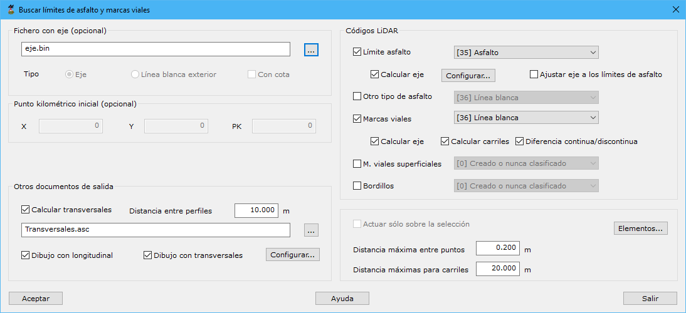

# Buscar líneas de vial

[Ficha de herramientas MMS Trazado](../)

Mediante esta herramienta se calcularán los límites generados por los puntos clasificados como asfalto y/o marcas horizontales de la carretera. Estos puntos podrán haber sido clasificados previamente con la herramienta [Asfalto](../clasificar-lineas-de-vial.md).

El resultado de esta herramienta será:

* Clasificación del documento original de los puntos pertenecientes al asfalto mediante el tipo 35 y los puntos pertenecientes a las marcas viales.
* Generación de un nuevo documento de geometría vectorial con los límites del asfalto, que representará la plataforma, y de las marcas viales horizontales.

El cuadro de diálogo necesita los siguientes datos:

* **Fichero con eje**:
* Punto kilométrico inicial:
* **Otros documentos de salida**:
* Códigos LiDAR
* Actuar sólo sobre la selección
* [Elementos](/mdtopx/fichas-de-herramientas/ficha-de-herramientas-editar/editar-elementos.md)
* Distancia máxima entre puntos
* Distancia máximas para carriles

<video controls><source src="https://youtu.be/J4uEcv8OIGU" type="video/mp4"></video>
Detección de carriles en vial a partir de datos MMS

