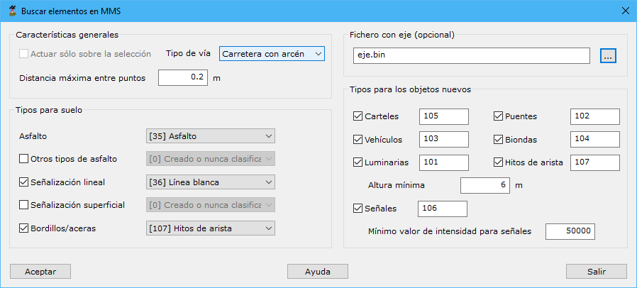

# Buscar objetos en el trazado

[Ficha de herramientas MMS Trazado](./)

Mediante esta herramienta se podrán clasificar puntos pertenecientes a objetos que están en el vial, o cercanos a él. Estos objetos pueden ser útiles para realizar un inventario de elementos de interés, o para ser eliminados de una modelización posterior, como pueden ser los vehículos que quedaron registrados por el escáner. Previamente a ejecutar esta herramienta, se debe haber ejecutado la herramienta de [Asfalto](clasificar-lineas-de-vial.md).

El resultado de esta herramienta será:

* Clasificación del documento original de los puntos pertenecientes a los objetos indicados.
* Generación de un nuevo documento de geometría vectorial con los límites de cada uno de los objetos encontrados.

El cuadro de diálogo necesita los siguientes datos:

* **Punto de registro**: Se deberán seleccionar los puntos de registro que se utilizarán en el cálculo.
* **Máxima distancia entre puntos**: Se indicará la distancia máxima entre dos puntos para ser considerados vecinos en el espacio.
* **Objetos a identificar**: Se deberán indicar qué elementos se desean identificar en el cálculo. Estos objetos son: Carteles informativos, Puentes o túneles, Vehículos, Luminarias, Biondas o quitamiedos y Señales de tráfico. Al seleccionar la búsqueda de un objeto se deberá indicar el tipo con el que se clasificarán los puntos identificados. Además, en el caso de las señales de trafico, se deberá indicar el valor mínimo de intensidad que deben tener los puntos.

<video controls><source src="https://youtu.be/Xp4bjqNUKIQ" type="video/mp4"></video>
Detección de activos en vial a partir de datos MMS

