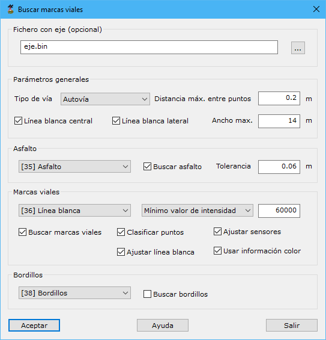

# Clasificar líneas de vial

[Ficha de herramientas MMS Trazado](./)

Mediante esta herramienta se clasificarán los puntos pertenecientes al asfalto y a las marcas horizontales de la carretera. Previamente a ejecutar esta herramienta, se debe haber ejecutado la herramienta de [Trazado](/mdtopx/modulo-mms/trazado/).

El resultado de esta herramienta será:

* Clasificación del documento original de los puntos pertenecientes al asfalto, a las marcas viales y a bordillos.
* Generación de un nuevo documento de geometría vectorial con los límites del asfalto, que representará la plataforma, y de las marcas viales horizontales.

El cuadro de diálogo necesita los siguientes datos:

* **Fichero con eje**: Este archivo es opcional pero aconsejable. Con él, el programa necesitará realizar menos cálculos y los resultados serán más precisos. Si no se dispone de él, el programa calculará una posible trayectoria que siguió el vehículo, a partir de la configuración de la nube de puntos. El formato de este archivo puede ser BIN, DXF, DGN o Shape. Incluso, puede ser el archivo ASCII de orientaciones de las imágenes registradas por el sensor MMS.
* **Parámetros generales**:
  * Tipo de vía: Desconocido, Urbana, Autopista, Carretera con arcén o Carretera sin arcén. En función de cada tipo, se realizarán unos cálculos u otros, particularizando según sus características.
  * Máxima distancia entre puntos: Se indicará la distancia máxima entre dos puntos para ser considerados vecinos en el espacio.
  * Línea blanca central
  * Línea blanca lateral
  * Ancho máximo
* **Asfalto**:
  * Tipología
  * Buscar asfalto
  * Tolerancia
* **Marcas viales**:
  * Tipología:
  * Intensidad:
    * Mínimo valor de intensidad: Valor mínimo de intensidad que deberá tener un punto para ser considerado perteneciente a una señal horizontal sobre el asfalto.
  * Buscar marcas viales
  * Clasificar puntos
  * Ajustar sensores
  * Ajustar línea blanca
  * Usar información color:
* **Bordillos**:
  * Tipología
  * Buscar bordillos

<video controls><source src="https://youtu.be/vWYrTWfFrps" type="video/mp4"></video>
Detección de asfalto en un vial a partir de datos MMS

Vea también:‌

* [Calcular líneas de asfalto](../editar-objetos/calcular-limite-de-asfalto.md)
* [Calcular líneas de vial](/mdtopx/modulo-mms/editar-objetos/calcular-lineas-de-vial.md)
