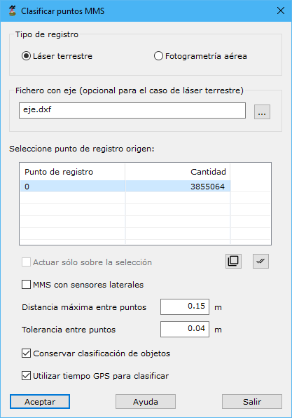

# Clasificar suelo de trazado

[Ficha de herramientas MMS Trazado](./)

Mediante esta herramienta se van a clasificar los puntos pertenecientes al suelo, registrados mediante un sistema MMS. Por tanto, el resultado de la aplicación de esta herramienta será el archivo clasificado en dos categorías, suelo (con el tipo 2) y no suelo (con el tipo 6).&#x20;

El cuadro de diálogo que aparece tiene los siguientes parámetros:

* **Tipo de registro**: Se deberá elegir entre _láser terrestre_, propio de sistemas MMS, o _Fotogrametría aérea_, propio de sistemas UAV.
* **Fichero con eje**: Es opcional pero aconsejable. Con él, el programa necesitará realizar menos cálculos y los resultados serán más precisos. Si no se dispone de él, el programa calculará una posible trayectoria que siguió el vehículo, a partir de la configuración de la nube de puntos. El formato de este archivo puede ser BIN, DXF, DGN o Shape. Incluso, puede ser el archivo ASCII de orientaciones de las imágenes registradas por el sensor MMS.
* **MMS con sensores laterales**: Se seleccionará si el sistema MMS tiene escáneres laterales, además del principal, que se suele ubicar en la parte central del vehículo.
* **Distancia máxima entre puntos**: Será la que se podría dar entre dos perfiles consecutivos de registro. Esta distancia dependerá de la velocidad que llevaba el vehículo en el momento del registro. Como dicha velocidad no será superior a 100 km/h, un valor habitual podría ser 20 cm.&#x20;
* **Tolerancia entre puntos**: Será la máxima discrepancia altimétrica que se puede dar entre puntos cercanos para considerarlos pertenecientes a la misma superficie. Si el vial recorrido es un camino irregular se debería aumentar entre valor. Un valor habitual podría ser 4 cm.
* **Conservar clasificación de objetos**: Si la nube de puntos ya tiene puntos clasificados, se pueden conservar con esta opción.
* **Utilizar tiempo GPS para clasificar**: Si la nube de puntos se ha registrado de manera continua y existe una relación entre la posición de los puntos y su momento de registro, se debería activar esta casilla para mejorar la clasificación. En caso de que se hayan realizado varias pasadas de escaneado, se debería desactivar.

<video controls><source src="https://youtu.be/2-7aQcy7pdU" type="video/mp4"></video>
Detección de suelo en vial a partir de datos MMS

