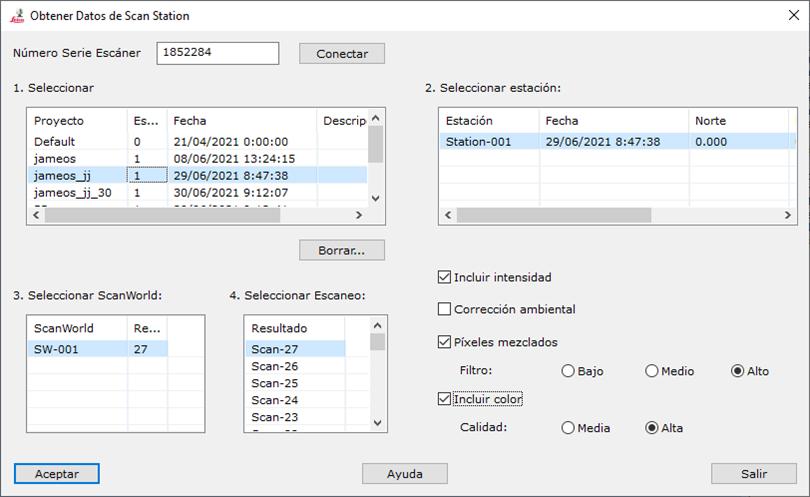

# Datos escáner

[Ficha de herramientas ScanStation](/mdtopx/fichas-de-herramientas/ficha-de-herramientas-scanstation.md)

Mediante esta herramienta se puede establecer comunicación con el escáner para extraer datos previamente registrados.

Los parámetros necesarios son los siguientes:

* Número serie escáner:
* Seleccionar proyecto:
* Seleccionar estación:
* Seleccionar ScanWorld:
* Seleccionar Escaneo:
* Incluir intensidad:
* Corrección ambiental:
* Píxeles mezclados:
* Incluir color:
