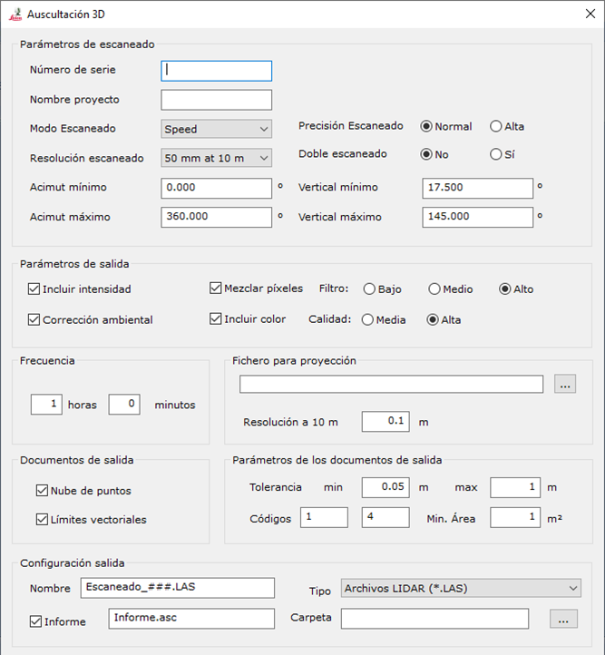

# Escaneado Auto

[Ficha de herramientas ScanStation](/mdtopx/fichas-de-herramientas/ficha-de-herramientas-scanstation.md)

Mediante esta herramienta se puede establecer comunicación con el escáner para realizar registros y comparaciones con un registro modelo según una frecuencia indicada por el usuario.

Los parámetros necesarios son los siguientes:

* **Parámetros de escaneado**:
  * _Número de serie_: Se deberá indicar el número de serie del escáner. Consultar la documentación del dispositivo para ver dónde se muestra este parámetro.
  * _Nombre proyecto_: Nombre del proyecto que se utilizará para almacenar el registro dentro del escáner. Si el proyecto no existe, se creará.
  * _Modo escaneado_: Se podrá elegir entre _Velocidad_, _Distancia_, _Distancia media_ o _Distancia larga_.
  * _Precisión escaneado_: Se podrá elegir entre _Normal_ y _Alta_.
  * _Resolución escaneado_: Las resoluciones disponibles a una distancia de 10 m son las siguientes:
    * 50 mm
    * 25 mm
    * 12.5 mm
    * 6.3 mm
    * 3.1 mm
    * 1.6 mm
    * 0.8 mm
  * _Escaneado doble_:
  * _Acimut mínimo_: Se indicará el ángulo horizontal mínimo según el cero del limbo horizontal del escáner en grados sexagesimales. Mínimo 0.
  * _Acimut máximo_: Se indicará el ángulo horizontal máximo según el cero del limbo horizontal del escáner en grados sexagesimales. Máximo 360.
  * _Vertical mínimo_: Se indicará el ángulo vertical mínimo desde la horizontal en grados sexagesimales. Mínimo -90.
  * _Vertical máximo_: Se indicará el ángulo vertical máximo desde la horizontal en grados sexagesimales. Máximo 90.
* **Parámetros de salida**:
  * _Incluir intensidad_: Si se desea incluir el valor de intensidad registrado en cada punto.
  * _Corrección ambiental_:
  * _Mezclar píxeles_:
  * _Incluir color_:
* **Frecuencia**: Se indicará la frecuencia en horas y minutos en la que se volverá a escanear.
* **Fichero para proyección**:
  * _Nombre_: Nombre del archivo modelo con el que se comparará el nuevo registro.
  * _Resolución_: Paso de distancia para hacer las comparaciones.
* **Documentos de salida**:
  * _Nube de puntos_: Si se desea la nube de puntos con los puntos donde se han encontrado diferencias.
  * _Límites vectoriales_: Si se desean los límites vectoriales generados con la agrupación de puntos donde han aparecido diferencias.
* **Parámetros de los documentos de salida**:
  * _Tolerancia_: Tolerancias mínimas y máxima entre las que se deben encontrar las diferencias que se desean considerar.
  * _Códigos_: Códigos en los que se almacenarán las zonas de diferencia negativa y positiva, respectivamente.
  * _Área mínima_: Valor mínimo que deberá tener una zona para ser considerada.
* **Configuración salida**:
  * _Nombre_: Nombre del archivo.
  * _Tipo_: Tipo de archivo
  * _Informe_: Si se desea generar un informe en formato ASCII.
  * _Carpeta_: Donde se almacenará el informe y el escaneado.
