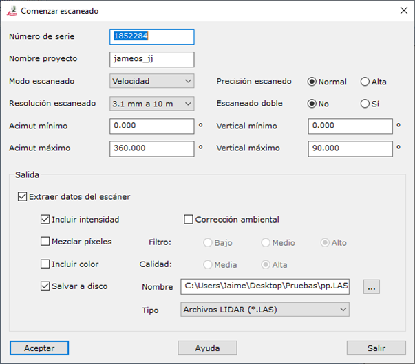

# Escanear

[Ficha de herramientas ScanStation](/mdtopx/fichas-de-herramientas/ficha-de-herramientas-scanstation.md)

Mediante esta herramienta se puede establecer comunicación con el escáner para iniciar un registro.

Los parámetros necesarios son los siguientes:

* **Número de serie**: Se deberá indicar el número de serie del escáner. Consultar la documentación del dispositivo para ver dónde se muestra este parámetro.
* **Nombre proyecto**: Nombre del proyecto que se utilizará para almacenar el registro dentro del escáner. Si el proyecto no existe, se creará.
* **Modo escaneado**: Se podrá elegir entre _Velocidad_, _Distancia_, _Distancia media_ o _Distancia larga_.
* **Precisión escaneado**: Se podrá elegir entre _Normal_ y _Alta_.
* **Resolución escaneado**: Las resoluciones disponibles a una distancia de 10 m son las siguientes:
  * 50 mm
  * 25 mm
  * 12.5 mm
  * 6.3 mm
  * 3.1 mm
  * 1.6 mm
  * 0.8 mm
* **Escaneado doble**:
* **Acimut mínimo**: Se indicará el ángulo horizontal mínimo según el cero del limbo horizontal del escáner en grados sexagesimales. Mínimo 0.
* **Acimut máximo**: Se indicará el ángulo horizontal máximo según el cero del limbo horizontal del escáner en grados sexagesimales. Máximo 360.
* **Vertical mínimo**: Se indicará el ángulo vertical mínimo desde la horizontal en grados sexagesimales. Mínimo -90.
* **Vertical máximo**: Se indicará el ángulo vertical máximo desde la horizontal en grados sexagesimales. Máximo 90.
* **Salida**:
  * _Extraer datos del escáner_: Se marcará esta casilla si se desean volcar los datos registrados sobre el ordenador. Si no se activa, el escaneo se quedará en la memoria del escáner.
  * _Incluir intensidad_: Si se desea incluir el valor de intensidad registrado en cada punto.
  * _Corrección ambiental_:
  * _Mezclar píxeles_:
  * _Incluir color_:
  * _Salvar a disco_: Se marcará esta casilla si se desea salvar el archivo a disco.
    * _Nombre_: Nombre del archivo.
    * _Tipo_: Tipo de archivo
