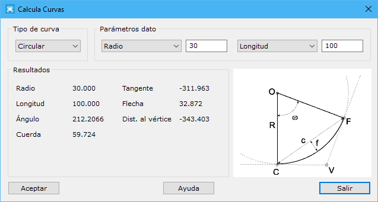
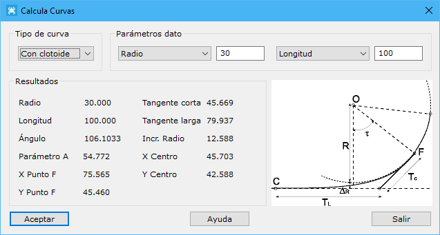

# Calcula curvas

[Viales General](/mdtopx/fichas-de-herramientas/ficha-de-herramientas-viales/viales-general.md)

Con esta herramienta el usuario podrá calcular elementos curvos a partir de dos parámetros que los definen. En función de estos parámetros el programa calculará el resto de elementos que podrán resultar de interés para su definición.

La herramienta podrá ser llamada sin tener ningún archivo abierto o desde el [cuadro de diálogo de definición de curvas](../trazado/insertar-elemento-curvo.md).

Los elementos curvos que se pueden definir son de dos tipos:

* **Circular**: Si se elige este tipo de curva, los parámetros que lo pueden definir son:
  * _Radio_: Valor del radio en metros.
  * _Longitud_: Distancia en el arco entre el punto C y el punto F.
  * _Ángulo_: Ángulo w medido en grados centesimales formado entre el radio del punto C y el del punto F. Si la herramienta es llamada desde el cuadro de diálogo de Inserción de elementos curvos, este parámetro será fijo.
  * _Cuerda_: Distancia lineal medida en metros entre el punto C y el punto F.
  * _Tangente_: Distancia entre el punto V y el punto F o el C, medida en metros.
  * _Flecha_: Máxima distancia entre el arco y la cuerda, medida en metros.
  * _Distancia al vértice_: Distancia entre el punto O y el punto V, medida en metros.

No todas las combinaciones tienen solución, como por ejemplo si se eligen como parámetros Longitud y Cuerda

* **Con clotoide**: Si se elige este tipo de curva, los parámetros que lo pueden definir son:
  * _Radio_: Radio del cálculo central, medido en metros.
  * _Longitud_: Distancia entre el punto C y el F, medida en la curva y en metros.
  * _Ángulo Tao_: Ángulo formado por la perpendicular a la tangente desde el centro del cálculo y el radio al punto de tangencia F, medido en grados centesimales.
  * _Parámetro A_: Constante adimensional de la curva.

Además de estos parámetros de definición, se muestran los siguientes:

* _Tangente corta_: Distancia desde el punto de tangencia F hasta la recta tangente, medida en la recta tangente al cálculo en dicho punto y en metros.
* _Tangente larga_: Distancia medida en la recta tangente desde el punto C al punto de corte con la tangente al cálculo en el punto F. Medida en metros.
* _Incremento del radio_: Diferencia entre el radio de cálculo central y la ordenada del centro del cálculo.
* _Coordenadas del punto F_: Coordenadas del punto de tangencia F, medidas a partir de la recta tangente.
* _Coordenadas del centro_: Coordenadas del centro de cálculo, medidas a partir de la recta tangente.

Si el cuadro de diálogo es llamado desde el cuadro de diálogo de [Inserción de Curvas](../trazado/insertar-elemento-curvo.md), se actualizarán automáticamente los campos en ese cuadro de diálogo.
