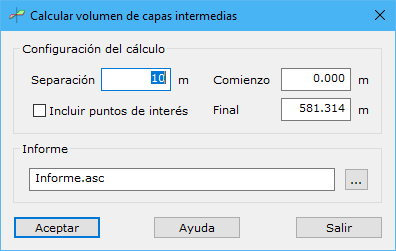

# Cubicar capas intermedias

[Viales Generar](/mdtopx/fichas-de-herramientas/ficha-de-herramientas-viales/viales-generar.md)

Desde esta herramienta, el usuario puede calcular el volumen de las capas intermedias definidas en las secciones tipo aplicadas en un determinado vial. La cubicación se hace mediante perfiles transversales. Al seleccionar la herramienta se muestra un cuadro de diálogo con los siguientes campos:

* **Separación**: Se indicará la separación en metros a lo largo del trazado entre cada perfil transversal.
* **Incluir puntos de interés**: Si se desean incluir perfiles en los puntos característicos del trazado.
* **Comienzo**: Se indicará el punto kilométrico inicial en metros a partir del cual se empezarán a calcular los perfiles transversales. Por defecto, será cero.
* **Final**: Se indicará el punto kilométrico final en metros hasta donde se calcularán los perfiles transversales. Por defecto, valdrán la longitud total del trazado.
* **Informe con los valores de volumen de las diferentes capas**.
