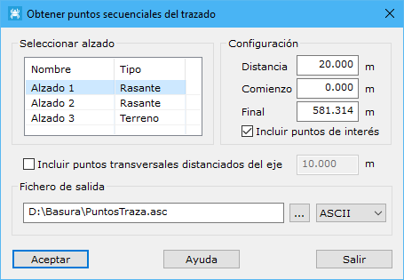

# Obtener puntos secuenciales del trazado

[Viales Generar](/mdtopx/fichas-de-herramientas/ficha-de-herramientas-viales/viales-generar.md)

Con esta herramienta, el programa permite la posibilidad de extraer puntos secuenciales de un determinado trazado y se respectivo alzado. De esta manera, se podrá generar un fichero de puntos para su posterior utilización en tareas de replanteos topográficos.

Cuando se ejecuta esta herramienta, el programa precisará que se seleccione un trazado de los existentes, hecho lo cual se mostrará un cuadro de diálogo con las propiedades del trazado seleccionado.

En el cuadro de diálogo se muestran los siguientes campos:

* **Alzado**: Se deberá seleccionar un alzado de los mostrados en la lista. Este alzado será utilizado para dar cota a los puntos secuenciales.
* **Distancia**: Distancia en metros a lo largo del trazado entre cada punto secuencial.
* **Comienzo**: Punto kilométrico de comienzo para la extracción de puntos.
* **Final**: Punto kilométrico de finalización para la extracción de puntos.
* **Incluir puntos de interés**: Si se desean incluir puntos característicos del trazado, como los vértices del estado de alineaciones que están sobre el trazado o los puntos de tangencia.
* **Incluir puntos transversales distanciados del eje**: Se puede activar esta opción para que el programa genere puntos distanciados del eje la distancia indicada y en la dirección perpendicular al eje, es decir, en el perfil transversal.
* **Fichero de salida**: Nombre del fichero de salida. Se podrá utilizar el botón situado a la derecha del nombre, para ubicar el archivo utilizando el explorador de Windows. Más a la derecha aparece el formato en el que se almacenará el fichero, pudiendo ser éste TopCal o ASCII.
