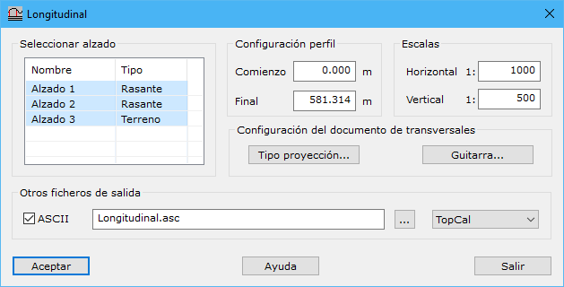

# Perfil longitudinal de viales

[Viales Generar](/mdtopx/fichas-de-herramientas/ficha-de-herramientas-viales/viales-generar.md)

Desde esta herramienta, el usuario puede generar un nuevo documento de dibujo con el perfil longitudinal de un trazado, con la configuración de los datos que se muestran a continuación:

* **Seleccionar alzado**: Se deberán seleccionar los alzados que tiene el trazado para incluir en el perfil longitudinal.
* **Configuración del perfil**:
* **Comienzo**: Se indicará el punto kilométrico inicial en metros a partir del cual se empezará a calcular el perfil longitudinal. Por defecto, será cero.
* **Final**: Se indicará el punto kilométrico final en metros hasta donde se calculará el perfil longitudinal. Por defecto, valdrán la longitud total del trazado.
* **Escalas**: Se indicarán los denominadores de la escala horizontal y vertical. Estos valores son importantes para calcular el factor de exageración vertical del perfil y los límites geométricos para el filtrado de puntos innecesarios en la definición del perfil.

Además, se puede configurar el tipo de proyección de los alzados sobre el MDT pulsando el botón [Tipo proyección](../../herramientas-mdt/perfiles/tipo-de-proyeccion.md).

Por otro lado, la información que se muestra de los perfiles transversales en la parte inferior de éstos, puede ser modificada en el cuadro de diálogo mostrado pulsando el botón [Guitarra](/mdtopx/herramientas-mdt/perfiles/guitarra.md).

Esta herramienta generará un documento de dibujo nuevo, que podrá ser salvado en formato BIN de DIGI, DXF de AutoCad, DGN de MicroStation o Shape de ESRI ArcGIS. Pero es posible obtener un documento adicional con los puntos del perfil longitudinal proyectado sobre el terreno. Este archivo podrá tener formato TopCal, Clip, Genius o TCP MDT para ser utilizado con dichos programas.
