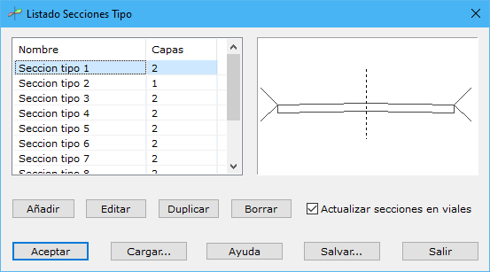

# Listado secciones tipo

[Secciones Tipo](/mdtopx/modulo-viales/secciones-tipo/)

Desde esta herramienta el programa gestiona las secciones tipo que podrán ser aplicadas posteriormente en los trazadas para terminar de definir un vial. El programa muestra un cuadro de diálogo con un listado con las secciones tipo disponibles y una previsualización de la sección tipo seleccionada de la lista.

En el cuadro de diálogo se proporcionan botones para poder **Añadir**, **Editar**, **Duplicar** o **Borrar** alguna de las secciones tipo existentes.

Al añadir o editar alguna sección tipo el programa muestra un [cuadro de diálogo](seccion-tipo.md)con las características de ésta.
