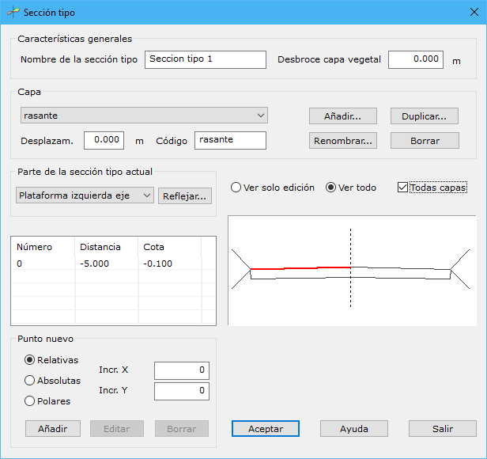

# Sección tipo

[Listado de Secciones Tipo](listado-secciones-tipo.md)

Desde este cuadro de diálogo, el usuario podrá diseñar la sección tipo que podrá ser aplicada en los trazados de los viales.

Los campos que definen las características generales de la sección tipo son:

* **Nombre**: Nombre para identificar la sección tipo posteriormente.
* **Desbroce de la capa vegetal**: Distancia en metros de la capa vegetal del terreno. Antes de proceder con la comparación entre los modelos digitales para calcular la cubicación, el programa quitará el volumen de esta capa del modelo digital original, debido a que es una capa que no se desea en el desmonte ni en el terraplén.

Cada capa estará dividida en las siguientes partes, subdivididas por una parte a la derecha y una a la izquierda del eje que pasa por el punto a partir del cuál será aplicada la sección tipo:

* **Plataforma**: Esta es la parte fija de la sección tipo, siempre aparecerá cuando se aplique.
* **Desmonte**: Esta será la parte de la sección tipo que se utilizará cuando el punto extremo de la plataforma está por debajo del terreno.
* **Terraplén**: Esta será la parte de la sección tipo que se utilizará cuando el punto extremo de la plataforma está por encima del terreno.

Se podrán asignar tantos puntos como se consideren a cada una de las partes. Si la sección tipo es simétrica respecto del eje, se recomienda diseñar uno de los lados y utilizar el botón **Reflejar** para copiar los datos al lado opuesto. Si en el lado opuesto existieran puntos, el programa nos avisará con un mensaje de sobre-escritura.

En el listado de puntos que aparece en la parte inferior de la elección de la parte que se va a editar, se muestran las características de éstos, mostrando un número, una distancia y una cota, respecto de un punto situado en el eje central y cuyas coordenadas serán 0,0.

La inclusión de puntos adicionales puede ser realizada de tres formas diferentes:

1. **Por coordenadas relativas**: Se introducirá el incremento en X e Y, respecto del último punto introducido. Si es el primer punto de la parte de la sección tipo que se está editando, se tomará como último punto, el último punto de la parte anexa.
2. **Por coordenadas absolutas**: Se introducirá el valor de la distancia y la cota respecto del punto central del eje.
3. **Por coordenadas polares**: Se indicará el valor de la distancia y la pendiente respecto del último punto introducido.

Además de **Añadir**, se pueden **Editar** o **Borrar** puntos de la sección tipo.

La sección tipo podrá tener una o varias capas. A cada capa se le podrá aplicar un desplazamiento vertical medido desde el eje, indicándolo en el campo **Desplazam**. Además, a cada capa se le puede asignar un código de dibujo diferente para cuando se proyecten las líneas del vial sobre el modelo digital se puedan identificar cada una de las capas por las líneas generadas.

El cuadro de diálogo proporciona herramientas para **Añadir**, **Duplicar**, **Renombrar** o **Borrar** capas.

Por último, en la parte inferior derecha se muestra un gráfico de cómo está quedando el diseño de la sección tipo, teniendo la posibilidad de ver sólo la parte de la sección tipo que se está editando, ver toda la sección tipo y visualizar todas las capas de la sección tipo o sólo la actual.
