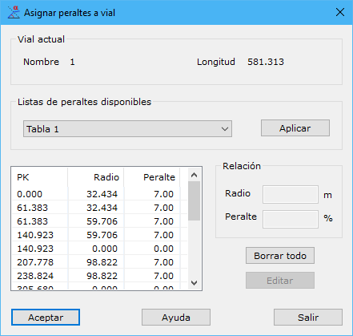

# Asignar peraltes a vial

[Tabla de peraltes](/mdtopx/modulo-viales/tabla-de-peraltes/tabla-de-peraltes.md)

Desde esta herramienta, el programa permitirá calcular los peraltes necesarios para la viabilidad de un trazado, en función de los elementos curvos que lo componen. Para ello, será necesario especificar una tabla de peraltes, previamente definida, donde se relacionan radios con peraltes.

En el cuadro de diálogo que se muestra aparecen los siguientes campos:

* **Vial actual**: Nombre y longitud del trazado seleccionado.
* **Listas de peraltes disponibles**: Se muestra un listado con las listas de peraltes que el programa tiene almacenadas. Estas listas pueden gestionarse desde la herramienta [Listado de Tablas de peraltes](tabla-de-peraltes.md). En este listado se deberá seleccionar la lista deseada y pulsar el botón Aplicar para que el programa calcule los peraltes para el trazado seleccionado, mostrando los resultados en el listado que aparece debajo.
* **Relaciones**: Listado con las relaciones entre radio y peralte calculadas para el vial actual. Se muestran, asimismo, los puntos kilométricos de los puntos importantes del vial donde se deberán aplicar los peraltes, es decir, las tangentes de los elementos curvos. En la parte derecha, aparecen dos botones para modificar este listado. Con el botón Borrar todos se podrán borrar todas las relaciones y poner todos los peraltes nuevamente a cero. Con el botón Editar se podrá editar una determinada relación.

Si se aceptar los peraltes calculados, con el botón **Aceptar**, el programa calculará automáticamente las transiciones que se deben aplicar entre los diferentes peraltes.

Posteriormente, se podrán editar estos peraltes calculados, volviendo a llamar a esta herramienta y seleccionando el mismo vial.
