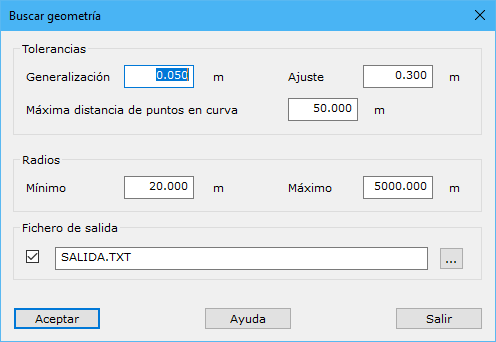

# Buscar geometría

[Ficha de herramientas Trazado](/mdtopx/fichas-de-herramientas/ficha-de-herramientas-trazado.md)

Mediante esta herramienta el programa es capaz de calcular los elementos que definen una secuencia de puntos, diferenciando entre elementos rectilíneos y curvos. A través de diversos ajustes se sitúan las tangentes de entrada y salida de los elementos curvos, definiendo su radio de curvatura.

Los parámetros necesarios son los siguientes:

* Generalización
* Ajuste
* Máxima distancia de puntos en curva
* Radios mínimo y máximo
* Fichero de salida

Una vez terminado el cálculo, el programa mostrará la [definición del trazado](informacion-del-trazado.md) calculado.
