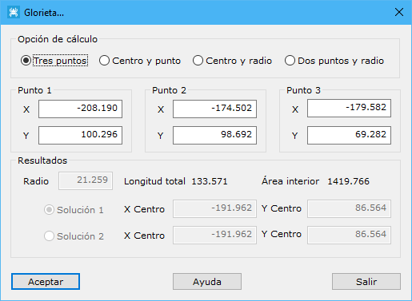

# Glorietas

[Ficha de herramientas Trazado](/mdtopx/fichas-de-herramientas/ficha-de-herramientas-trazado.md)

Cuando el usuario introduce una glorieta como trazado nuevo, el programa muestra el siguiente cuadro de diálogo donde se activará la opción de cálculo elegida para su registro y los resultados obtenidos, representados por el centro de la glorieta y el radio de ésta.

Para registrar una glorieta nueva se debe elegir alguna de las opciones disponibles en la [Ficha de herramientas Trazado](/mdtopx/fichas-de-herramientas/ficha-de-herramientas-trazado.md).

Los datos que se muestran los siguientes:

* **Opción de cálculo**: Se elegirá la opción para calcular la glorieta nueva, teniendo las siguientes posibilidades:
  * _Tres puntos_: Se designarán tres puntos pertenecientes al trazado de la glorieta.
  * _Centro y punto_: Se designará el centro de la glorieta y un punto perteneciente al trazado.
  * _Centro y radio_: Se designará el centro de la glorieta y el radio de ésta.
  * _Dos puntos y radio_: Se designará dos puntos pertenecientes al trazado de la glorieta y radio de ésta.
  * _Punto 1, Punto 2, Punto 3_: Datos de entrada para calcular la glorieta. Se activarán o desactivarán en función de la opción de cálculo seleccionada anteriormente.
* **Resultados**: Por último se mostrarán los datos calculados. Estos datos podrán ser de entrada o salida en función de la opción de cálculo seleccionada anteriormente. Son los siguientes:
  * _Radio_: Valor del radio de la glorieta en metros.
  * _Coordenadas del centro_: Centro de la glorieta. Si se eligió _Dos puntos y radio_ en la **Opción de cálculo**, se darán dos posibles soluciones, por lo que se deberá elegir cuál se desea.
  * _Longitud total_: Longitud total del trazado en metros.
  * _Área interior_: Área interior al trazado en metros cuadrados.

Una vez aceptados los datos calculados, el programa mostrará un [cuadro de diálogo](insertar-elemento-curvo.md)con el nuevo trazado de la glorieta, donde se mostrarán los vértices y las correspondientes tangentes.
