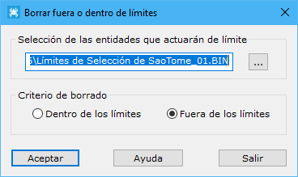

# Borra en límites

[VirtuaLand Editar](/mdtopx/fichas-de-herramientas/ficha-de-herramientas-virtualand/virtualand-editar.md)

Esta herramienta permitirá borrar puntos de la rejilla dentro o fuera de límites. Estos límites podrán estar almacenados en líneas cerradas en archivos de dibujo (formato DIGI, AutoCAD o MicroStation). Esta utilidad servirá para borrar información donde no se desean realizar cálculos, por ejemplo, curvados o proyección de perfiles.

En este cuadro de diálogo aparecen los siguientes campos a rellenar:

* **Selección de las entidades que actuarán de límite**: Se cargarán como límites entidades de dibujo almacenadas en algún archivo. Estas entidades deberán estar cerradas.
* **Criterio de borrado**: El criterio de borrado indicará el lugar donde se borrarán triángulos, habiendo dos opciones:
  * _Dentro de los límites_
  * _Fuera de los límites_
