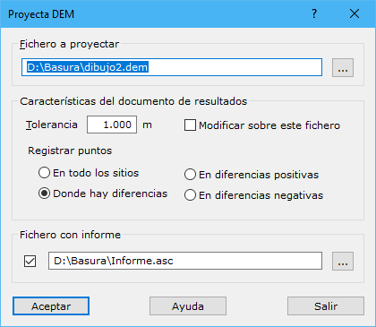

# Comparar dos DEM

[ VirtuaLand General](../fichas-de-herramientas/ficha-de-herramientas-virtualand/virtualand-general.md)

Esta herramienta está destinada a la comparación de dos modelos digitales realizados de la misma zona. Su comparación permitirá emitir un informe de resultados con las diferencias encontradas.

Al llamarla se muestra un cuadro de diálogo donde aparecen los siguientes campos:

* **Fichero a proyectar**: Se deberá indicar la tura del archivo con el modelo digital que se desea proyectar sobre el modelo digital actual. Para ello se puede utilizar el botón situada a la derecha, que abrirá el explorador de Windows.
* **Características del documento de resultados**: En esta sección se indicará la manera de calcular, mediante los siguientes parámetros:
* **Tolerancia**: Se indicará un valor lineal en metros a partir del cual el programa considerará que la diferencia de altitud encontrada no es admisible, considerándose un error entre los modelos.
* **Modificar sobre este fichero**: Se podrá activar esta opción para modificar el fichero actual almacenando en él las diferencias encontradas. Esta opción permitirá ahorrar memoria debido a que no se genera un nuevo documento con las diferencias.
* **Registrar puntos**: Se deberá elegir dónde se desea registrar puntos, permitiéndose las siguientes opciones:
  * _En todos los sitios_: Se registrarán todos los puntos proyectados cuya cota será la diferencia encontrada.
  * _Donde hay diferencias_: Se registrarán sólo puntos donde se hayan encontrado diferencias superiores a la tolerancia indicada.
  * _En diferencias positivas_: Se registrarán sólo puntos donde se hayan encontrado diferencias positivas superiores a la tolerancia indicada.
  * _En diferencias negativas_: Se registrarán sólo puntos donde se hayan encontrado diferencias negativas superiores a la tolerancia indicada.
* **Fichero con informe**: Se podrá activar esta opción para generar un archivo de texto con los puntos proyectados y las diferencias encontradas, así como un resumen estadístico. Se podrá utilizar el botón situado a la derecha para seleccionar la ubicación de este archivo.
