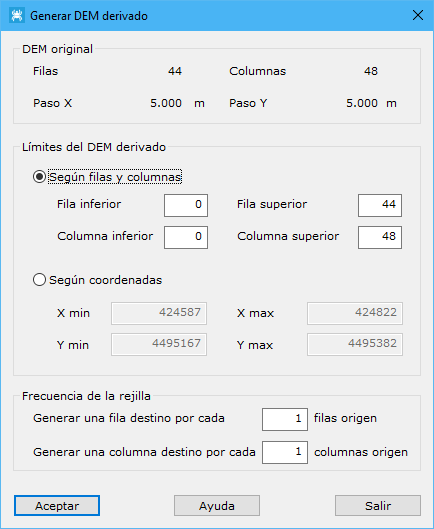

# Generar DEM derivado

[VirtuaLand General](/mdtopx/fichas-de-herramientas/ficha-de-herramientas-virtualand/virtualand-general.md)

Esta herramienta está destinada a la generación de un modelo digital derivado del actual como consecuencia de un recorte de éste o una reducción en la densidad de puntos.

Al llamarla se muestra un cuadro de diálogo donde aparecen los siguientes campos:

* **DEM original**: Se muestra información acerca del actual modelo digital compuesta por el número de filas y columnas y la separación entre éstas.
* **Límites del DEM derivado**: En este apartado se deberán indicar los límites del modelo digital derivado. Si se desea tener las mismas dimensiones que el modelo actual, no se deberá modificar ningún valor porque son los correspondientes al modelo actual. Pero si se desea obtener un recorte del modelo actual se podrá hacer de dos formas:
* **Según filas y columnas**: Se podrán indicar los límites de filas y columnas que se desean incluir en el modelo derivado.
* **Según coordenadas**: Se podrán indicar los límites del modelo derivado según las coordenadas X e Y máximas y mínimas.
* **Frecuencia de la rejilla**: Por último, es posible que se desee tener menor densidad de información en el modelo digital derivado, por lo que se ofrece la posibilidad de indicar cada cuánto se desea generar una fila o columna. Si no desea variar la densidad del modelo, estos valores deberían ser 1.
