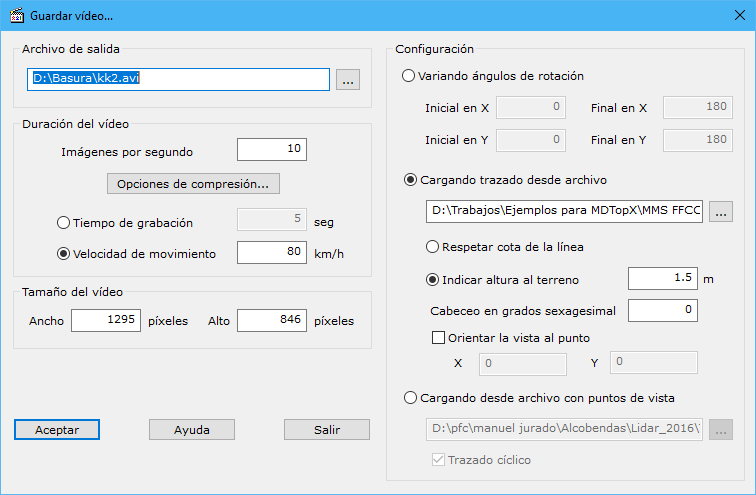

# Generar video

[VirtuaLand Generar Video](/mdtopx/fichas-de-herramientas/ficha-de-herramientas-virtualand/virtualand-generar-video.md)

Esta herramienta está destinada a la generación de un video en formato AVI con el movimiento alrededor de un modelo digital o archivo. Al llamarla se muestra un cuadro de diálogo donde aparecen los siguientes campos:

* **Archivo de salida**: Se indicará el nombre del archivo donde se va a almacenar el video. Se podrá abrir el explorador de Windows con el botón que aparece a la derecha para elegir la ubicación del archivo.
* **Duración del video**: La duración del video viene definido por dos parámetros: las imágenes por segundo y la duración total del video:
  * _Imágenes por segundo_: Se deberá indicar un valor que suele variar entre 5 y 10. A más imágenes por segundo mayor tamaño del archivo pero mayor suavidad en el movimiento de éste.
  * _Tiempo de grabación_: Se podrá indicar un tiempo máximo de grabación en segundos. A partir de este tiempo se calculará la velocidad a la que se tiene que mover la cámara.
  * _Velocidad de movimiento_: Se podrá indicar una velocidad de movimiento de la cámara a partir de la cual se calculará el tamaño máximo de grabación del video.
* **Tamaño del video**: Se deberá indicar el ancho y alto en píxeles de la ventana del video.
* **Configuración**: En este apartado se deberá indicar qué tipo de video se quiere generar. Se ofrecen dos opciones:
  * _Variando ángulos de rotación_: Se podrá generar un video en el que se gira el modelo según el rango de los ángulos en el eje X e Y que se ofrecen.
  * _Cargando trazado desde archivo_: Se podrá generar un video cargando el trazado de la cámara a partir de un archivo de dibujo (BIN, DXF, DGN o ASCII). Este trazado podrá tener cota propia y utilizarla para calcular la altura de la cámara; o se podrá proyectar sobre el modelo y añadir un valor de altura sobre el terreno . Además se podrá incluir un valor de cabeceo a la cámara para que se oriente hacia abajo. Por último, también se da la posibilidad de orientar la vista siempre al mismo punto del modelo, de tal manera que según va avanzado en el trazado se mantenga una vista fija de un determinado lugar.
  * _Cargando desde archivo con puntos de vista_: Se podrá generar un vídeo a partir de un archivo donde se han almacenado diferentes puntos de vista. Este archivo puede ser generado con la herramienta [Salvar puntos de vista](salvar-puntos-de-vista.md)Además, se da la posibilidad de que el trazado sea cíclico, es decir, que al llegar al final vuelva al primer punto del fichero
