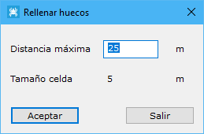

# Rellenar huecos

[VirtuaLand Editar](/mdtopx/fichas-de-herramientas/ficha-de-herramientas-virtualand/virtualand-editar.md)

Herramienta destinada al relleno de huecos interiores de la rejilla, por medio de la interpolación con los puntos vecinos. Es útil cuando la rejilla se ha generado a partir de la interpolación de datos irregulares y en algún lugar no se ha mantenido la densidad general, generándose huecos no deseados.

El cuadro de diálogo presenta dos campos:

* **Distancia máxima**: El usuario deberá introducir cuál la distancia máxima del hueco que el programa debe rellenar por medio de interpolación.
* **Tamaño de celda**: El programa muestra el tamaño actual de celda de la rejilla para poder indicar un tamaño máximo de hueco.

Las modificaciones se realizan sobre el documento actual.
